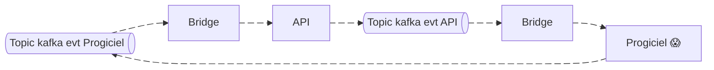
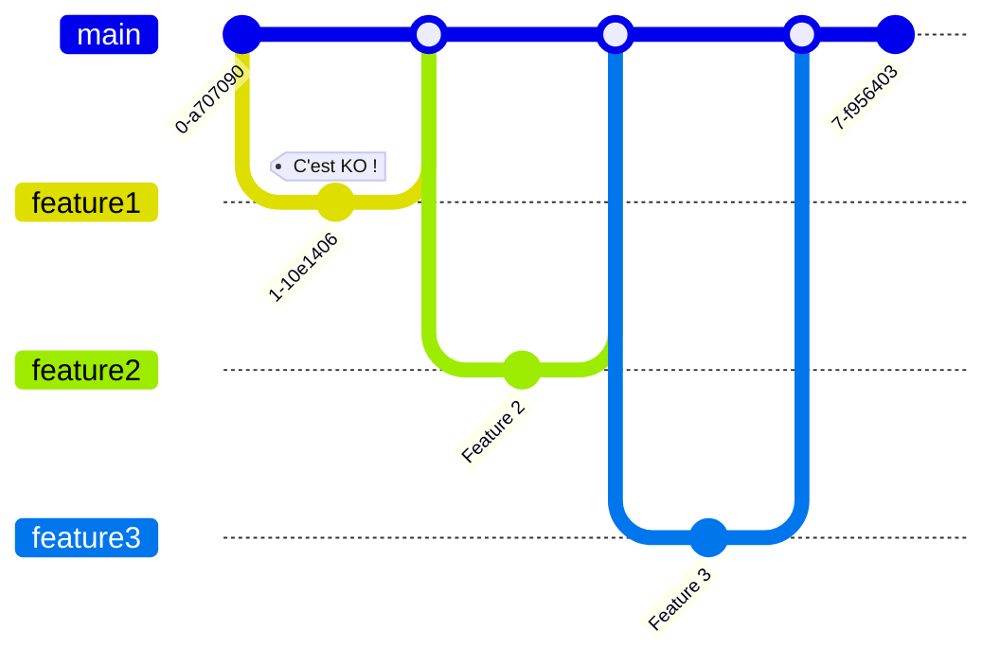
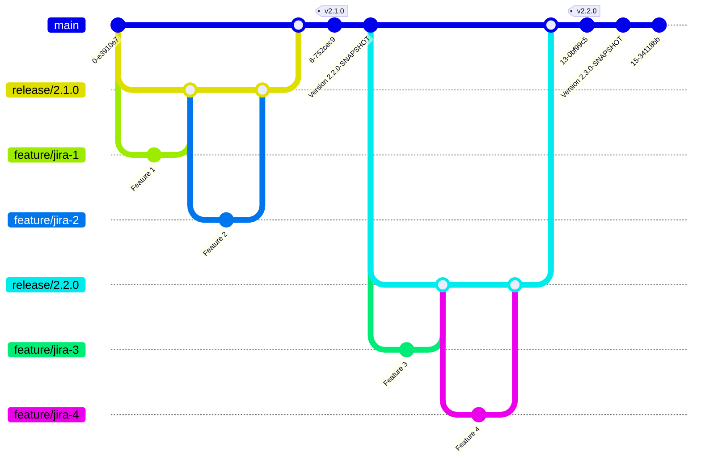

# Trunk base et kanban

À la MAIF, le flow de dév le plus communément appliqué, c'est du gitflow et du scrum.
Personnellement, j'ai du mal à comprendre le gitflow et je ne comprends pas à quoi sert la branche develop du moins pour le développement d'application. Les branches support ne sont pas utiles car, on ne maintient qu'une version de notre application à un moment donné.
J'ai également l'impression que la branche master et develop finissent obligatoirement par avoir un historique divergent, à moins de rebase develop à partir de master de faire un force push.

En ce qui concerne le scrum, je trouve que ça génère une pression continue, on est toujours en train de se prendre la tête sur les stories pour savoir si ça va rentrer ou non dans le sprint. Ça n'est pas très chill comme méthode.

Depuis quelques années sur notre projet, nous avons mis en place un flow un peu atypique à base de trunk base. C'est ce que je vais vous présenter ici.

{/* truncate */}

## L'instant musical

<iframe width="560" height="315" src="https://www.youtube.com/embed/ktHLBveEOdg?si=6mS7W41Nuip6FJSE" title="YouTube video player" frameborder="0" allow="accelerometer; autoplay; clipboard-write; encrypted-media; gyroscope; picture-in-picture; web-share" referrerpolicy="strict-origin-when-cross-origin" allowfullscreen></iframe>

## Le commencement

Au début du projet, c'était simple, peu d'utilisateurs, 2 dév sur le projet, on faisait un trunk base classique et on livrait en production très rapidement.

Mais le projet grossit, la complexité aussi, l'équipe aussi, le nombre de features développées en parallèle également et les ennuis commencèrent.

Le contexte du projet, c'est une API qui gère des données de personnes. Ces données étaient, initialement stockées dans un progiciel, et nous cherchons maintenant à rapatrier ces données au fur et à mesure dans notre API.
Pour ça nous avons 2 briques basées sur kafka qui vont synchroniser en presque temps réél du progiciel vers notre API ou de notre API vers le progiciel.

```mermaid
flowchart LR
   Topic1@{ shape: das, label: "Topic kafka evt Progiciel" }
   Topic2@{ shape: das, label: "Topic kafka evt API" }

   progiciel["Progiciel 😱"]
   API["API"]
   Bridge1["Bridge"]
   Bridge2["Bridge"]

   progiciel e1@--> Topic1
   e1@{ animate: true }
   Topic1 e2@--> Bridge1
   e2@{ animate: true }
   Bridge1 e3@--> API
   e3@{ animate: true }
   API e4@--> Topic2
   e4@{ animate: true }
   Topic2 e5@--> Bridge2
   e5@{ animate: true }
   Bridge2 e6@--> progiciel
   e6@{ animate: true }
```

Il est très difficile de tester correctement, lors de la phase de dév, les briques de synchronisation, car le progiciel (et ses API) sont pleins de surprises.

Il arrive donc régulièrement qu'une PR qui a été review par l'équipe et, qui est couverte par des tests unitaires, ne fonctionne pas du tout une fois déployée sur un environnement de QA.

Avec quatre développeurs dans l'équipe, et avec du trunk base, on arrive vite à une situation ou une PR mergée bloque tout le monde, car elle contient un bug.

Ici, tant que le bug de feature 1 n'est pas corrigé, il n'est pas possible de livrer feature 2 et feature 3 en production :

```mermaid
gitGraph:
    commit "init"
    branch feature1
    checkout feature1
    commit tag:"C'est KO !"
    checkout main
    merge feature1
    branch feature2
    checkout feature2
    commit id:"Feature 2"
    checkout main
    merge feature2
    branch feature3
    checkout feature3
    commit id:"Feature 3"
    checkout main
    merge feature3
    commit
```

## La liste au père noël

Ce que l'on souhaite, c'est :
* Pouvoir lotir des features dans une release candidate
* Éviter d'embarquer une feature qui bloque les autres features
* Avoir un bon niveau de confiance lors de notre mise en prod et éviter les bugs (évidemment)
* Avoir un changelog et connaitre le contenu de chaque release
* Donner de la visibilité à nos clients sur les features en cours de dév et le contenu des releases à venir

## The new flow

Sur un développement de librairie, il peut y avoir plusieurs versions en parallèle à gérer. Dans un contexte d'API ça n'est pas le cas.
Le trunk base, où, le tronc est la version de prod, nous convient parfaitement.

Par contre, on souhaite identifier les features qui partiront ensemble dans la prochaine release. Après des débats endiablés, on a donc décidé de suivre le flow suivant :

* On crée une branche `release/X.X.X` à partir du tronc qui servira de receptacle pour les features de cette version
* On crée dans github une milestone `X.X.X` qui nous servira de changelog
* Le développeur prend une tâche prioritaire dans Jira
* Pour chaque tâche, on crée une branche `feature/foo` à partir de `release/X.X.X`
* On crée une PR pour la branche `feature/foo`, on l'ajoute à la milestone `X.X.X` et on choisit `release/X.X.X` comme cible pour le merge
* On fait apparaître le numéro de la jira correspondante dans le titre de la PR
* La CI (ici github action) en plus de l'exécution des tests etc, produit un livrable avec la `X.X.X-numéroPR-SNAPSHOT`, ce livrable sera testable sur un env de QA
* Une fois la PR validée par les tests, revue etc on la merge sur la branche `release/X.X.X` (avec un petit rebase avant), une github action publie un message dans teams pour indiquer le contenu de la release a changé et la liste des features mergées est affichée.
* Avant de créer une release, on refait une passe de tests pour vérifier toutes les features ensembles
* Pour faire une release, on "rebase and merge" `release/X.X.X` sur le tronc, on utilise le gradle release plugin pour tagger la version et passer à la version suivante. Le livrable final est produit ici.
* On rebase ensuite toutes les autres branches de release qui seraient en cours.

On obtient quelque chose comme ça :

```mermaid
gitGraph:
    commit "init"
    branch release/2.1.0
    checkout release/2.1.0
    branch feature/jira-1
    checkout feature/jira-1
    commit id:"Feature 1"
    checkout release/2.1.0
    merge feature/jira-1
    branch feature/jira-2
    checkout feature/jira-2
    commit id:"Feature 2"
    checkout release/2.1.0
    merge feature/jira-2
    checkout main
    merge release/2.1.0
    commit tag:"v2.1.0"
    commit id: "Version 2.2.0-SNAPSHOT"
    branch release/2.2.0
    checkout release/2.2.0
    branch feature/jira-3
    checkout feature/jira-3
    commit id:"Feature 3"
    checkout release/2.2.0
    merge feature/jira-3
    branch feature/jira-4
    checkout feature/jira-4
    commit id:"Feature 4"
    checkout release/2.2.0
    merge feature/jira-4
    checkout main
    merge release/2.2.0
    commit tag:"v2.2.0"
    commit id: "Version 2.3.0-SNAPSHOT"
    commit
```

### Le feature flipping

Tout ça ne serait pas possible sans feature flipping. Ça nous permet de livrer en production sans attendre d'avoir développé l'intégralité d'une feature.

On alterne entre PR dormante, qu'on garde au chaud pour plus tard, et feature flipping sur lequel on teste, au minimum, la désactivation pour s'assurer que ça puisse monter en prod.

### Organisation de l'équipe

Tous les lundis, on fait le point sur les features qui ont été développées et testées et qui sont prêtes à partir. Si on a rien, bah on verra plus tard hein !
Si on a des choses à livrer, le mardi, on fait le dernier tour de tests et on prépare la release finale.

Le mercredi on livre en prod et c'est reparti pour un tour.

Comme indiqué plus tôt, les tests automatisés présents dans nos livrables ne suffisent pas car, on ne maitrise pas le format des données qui proviennent du progiciel.
Notre testeur à également une batterie de test automatisés qui s'appuient sur un environnement de QA, ça fait un bon filet de sécurité en plus.

Si on résume, on pratique un mix de kanban et de scrum avec une itération d'une semaine et un trunk base qui est un mix de trunk base et de gitflow.

### Gestion des hotfix

Pour gérer un hotfix, on peut tout simplement tirer une branche à partir du tronc, on suivra ensuite le flow classique.

## Et maintenant ?

Après discussion avec l'équipe, on a identifié quelques petites pierres dans l'engrenage :
* on génère beaucoup d'aller-retour entre le testeur et les dév pour déployer la bonne version à tester
* si on monte en prod une version vérolée, le tronc devient KO et ça peut poser des problèmes pour la suite et empêcher de futures mises en prod.

Pour limiter les aller-retour entre les dév et les tests, l'idée serait de rendre autonome le testeur sur le déploiement des versions.

Pour ne pas pourrir le tronc avec une version livrée à tort en production, on pourrait merger la branche de release qu'une fois la mise en prod faite et validée.

That all folks, To be continued !

## PS

Si vous avez des remarques, des commentaires, des critiques ...  [c'est ici que ça se passe](https://github.com/larousso/larousso.github.com/discussions/5)