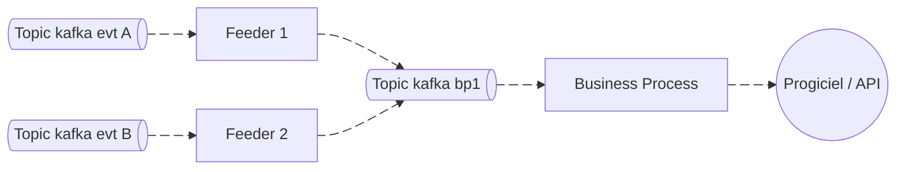
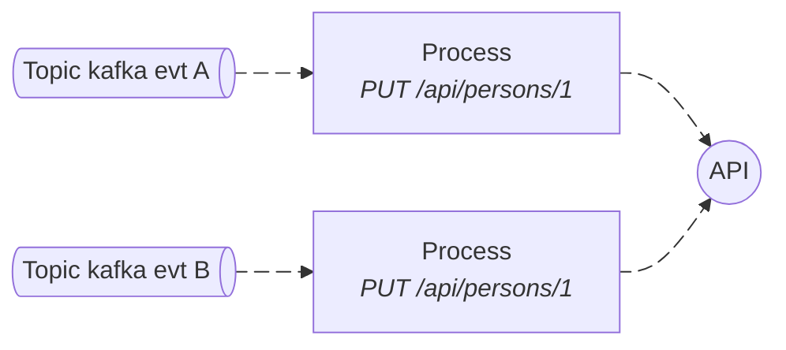
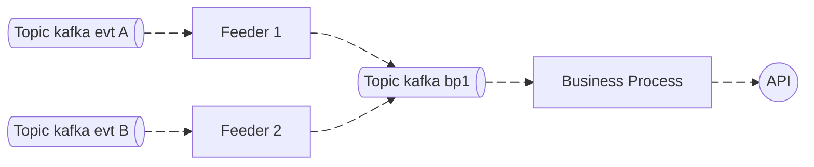

# Archi événementielle basée sur kafka : un cas pratique

À la [MAIF](https://maif.github.io/) Je travaille sur les données de connaissances de la personne. Ces données étaient gérées par un CRM du marché, un peu vieillissant.
Sur le coeur de métier, la MAIF a choisie le "build" à la place du "buy" et donc sur ce périmètre, on remplace le CRM par un applicatif fait main, réalisé par une équipe d'artisans.

Une des taches, qui nous occupe pas mal, c'est, de synchroniser les données entre le CRM et notre applicatif, que ce soit dans un sens ou dans l'autre.
Pour ce faire, nous avons mis en place une architecture logicielle que je vais présenter ici.

{/* truncate */}


## L'instant musical

<iframe width="560" height="315" src="https://www.youtube.com/embed/0OGuRBoxEOk?si=_MfMVC_VOG7QeAoy" title="YouTube video player" frameborder="0" allow="accelerometer; autoplay; clipboard-write; encrypted-media; gyroscope; picture-in-picture; web-share" referrerpolicy="strict-origin-when-cross-origin" allowfullscreen></iframe>

## Le context

Notre équipe récupère un domaine fonctionnel qui était géré dans un progiciel. Dans un premier temps, nous étions un réplica à 100% mais,
au fur et à mesure, nous prenons la main sur des morceaux du domaine, jusqu'à être en responsabilité de la totalité.

Les modèles de données ne sont pas tout à fait les mêmes des deux côtés, donc quand un événement arrive, il faut réaligner les modèles avant de créer ou mettre à jour les données.

Voici les points de vigilance concernant les synchros :
* On ne veut pas créer de doublons
* On ne veut pas rater de mise à jour
* Pour une même donnée, on ne veut pas de mise à jour concurrente (on risquerait de perdre des mises à jour)
* On veut tracer les problèmes

## L'architecture mise en place

Pour nos synchros, on a mis 2 typologies de composants (le nommage est fait maison, il est peut être un peu naze ...) :
* Les feeders
* Les business process



### Le business process

Le but de ce composant est de gérer la réplication d'une entité / agrégat vers le système cible.
Ici on va gérer le fait de créer, modifier ou supprimer une donnée. On va gérer le mapping, les conversions de données etc.

Ce composant prend en entrée un set de commandes qui pourront par exemple être représentées par un type union.

Le comportement classique serait :
* On appel l'api du système cible pour voir si la donnée existe
* Si elle existe, on fait une mise à jour : annule et remplace ou maj partielle
* Si elle n'existe pas, on fait une création

### Le feeder
 

Le feeder "nourrit" le business process. Il capte des événements de différentes sources et a pour but de fabriquer les bonnes commandes pour le business process.
Le feeder positionne aussi la clé de sharding sur les messages kafka, c'est un élément important, dont on va parler tout de suite.


### Gestion de la concurrence

Un des problèmes lorsque nous synchronisons des données, c'est que des messages qui proviennent de topics différents peuvent déclencher au final, la mise à jour d'une même entité.
Les messages (ou événements) source, étant dans des topics différents, ou même des partitions différentes, seront surement consommés en parallèle.

Si ces messages déclenchent des mises à jour, on aura des mises à jour concurrentes et donc, probablement de la perte en ligne.



Dans kafka, sur les messages, on peut spécifier une clé. Cette clé sert à router les messages, et, à s'assurer que les messages avec la même clé seront consommés dans l'ordre.

Avec notre architecture, où les feeders produisent des commandes pour nos business process, en jouant sur la clé des messages, nous allons automatiquement réordonner les choses.
Toutes les mises à jour d'une même entité seront consommées dans l'ordre, le problème de mise à jour concurrente est résolue.




### Gestion des erreurs : Retry backoff et DL queue


Tu vois, les erreurs se divisent en 2 catégories :
* Les erreurs qu'on peut gérer
* Les erreurs qu'on ne peut pas gérer

#### Les erreurs qu'on peut gérer : "recoverable"

Ce sont les erreurs techniques : l'API qui répond une 500, une base de données non disponible etc

Pour gérer ces erreurs, la technique c'est : let it crash !

On laisse crasher, le process reprendra au dernier commit.
Afin de ne pas DDOS le système qui est en face, et, qui n'est peut-être pas très en forme, on peut augmenter le temps entre chaque retry. On appel ça du "exponential backoff".

Avec une librairie de streaming comme [Apache Pekko](https://pekko.apache.org/) ou [Reactor](https://projectreactor.io/), on peut faire quelque chose comme ça :

Dans reactor
```java
KafkaReceiver
    .create(receiverOptions)
    .receive()
    // 1 stream par partition :
    .groupBy(m -> m.receiverOffset().topicPartition())
    .flatMap(partitionFlux -> partitionFlux
                  .map(record -> ...)
    )
    // Retry en cas de problèmes
    .retryWhen(Retry
            .backoff(Long.MAX_VALUE, Duration.ofSeconds(1))
            .maxBackoff(Duration.ofSeconds(30))
            .transientErrors(true)
    )
```

Dans pekko
```java
// Retry en cas de problèmes
RestartSource.onFailuresWithBackoff(
        RestartSettings.create(
                Duration.ofSeconds(1),
                Duration.ofSeconds(30),
                0.2
        ),
        () -> Consumer.committablePartitionedSource(consumerSettings, Subscriptions.topics("mon-topic"))
                .flatMapMerge(20, partitionAndSource ->
                    // 1 stream par partition :
                    partitionAndSource.second()
                        .map(record -> ...)
                 )
)
```

#### Erreurs qu'on ne peut pas gérer : "non recoverable"

Les erreurs "non recoverable", sont les erreurs qu'on ne pourra jamais gérer par un retry : on ne sait pas désérialiser le message, l'API répond avec une bad request, une NullPointerException etc

Une stratégie assez connue est d'utiliser une "dead letter queue", c'est une file dédiée pour stocker les erreurs et pouvoir les traiter plus tard, généralement après une action humaine.

#### La gestion des erreurs a l'épreuve du feu !

Même si le pattern de gestion des erreurs semble plutôt bien, en production on va avoir des surprises !
Faire un retry infini quand c'est une erreur "non recoverable" peut avoir des conséquences désastreuses ! Et oui, on se ratera forcément à un moment sur la gestion des erreurs.

On va tout simplement, bloquer complétement la consommation des messages sur une partition d'un topic.

Mais alors que faut-il faire ?

Recommencer un certain nombre de fois et ensuite, mettre le message dans la dead letter queue ?

Mais alors, si c'est l'API qui n'est pas disponible, on va perdre une grosse quantité de messages qu'il faudra gérer à la main !

On peut imaginer tout un tas de stratégies, acceptables en fonction du contexte.

A minima, il faut monitorer les lags, afin de pouvoir réagir et analyser rapidement en cas de problèmes. Il est également nécessaire de pouvoir commiter facilement un message qui bloquerait tout le monde à tort.

### Gestion des doublons et idempotence

Utiliser des retry pour gérer les erreurs a une autre conséquence : la création de doublons.

On va prendre un exemple, pour illustrer ce problème :

Un message arrive, on vérifie, si la donnée existe déjà, ce n'est pas le cas, on doit la créer !

On peut imaginer intéragir avec une API REST, alors, on envoie un `POST` sur `/api/mes-ressources`, et là, pas de bol, TIMEOUT !

Que s'est-il passé ? La donnée est-elle créée ? Faut-il faire un retry ? Personne ne sait !

Si malgré le timeout, la donnée avait bien été créée et qu'un retry est fait, alors on crée un doublon !

2 solutions pour résoudre ce problème :
* Il existe une contrainte d'unicité sur un des attributs, la création de doublons n'est pas permise, on est sauvé !
* La génération de l'identifiant de la donnée est possible côté client. A ce moment-là, en cas de retry, soit on va écraser la donnée déjà créée, soit on aura une erreur nous indiquant que la donnée existe déjà, on est sauvé !

Dans nos cas de synchros à nous, quand on pousse vers le progiciel, on est dans le cas 1 (contrainte d'unicité), quand on pousse vers notre API, on est dans le 2ème cas, en tant que client de l'API, on peut générer un uuid qui sera l'id primaire de la donnée.

De manière générale, il est nécessaire que, les composants qui consomment des messages soient [idempotent](https://fr.wikipedia.org/wiki/Idempotence) car il existe de multiples de cas ou un consommateur devra consommer plusieurs fois le même message (même en utilisant le mode "exactly once" de kafka).

### Impact des mises à jour de masse

Dernier point à prendre en compte : absorber des mises à jour en masse. Il arrive régulièrement que des batchs tournent et provoquent la publication de messages en nombre. Mais comment absorber la charge ?

#### Utiliser correctement les partitions

Le commit dans kafka se fait à la partition, ce qui veut dire qu'on ne pourra consommer qu'un message à la fois par partition.
Le nombre de partitions indique la capacité du consommateur a consommer des messages en parallèle. 10 partitions, c'est consommer 10 messages à la fois.

Mais attention ! Tenir compte des partitions, n'est pas toujours le comportement par défaut des libraires.

Si on prend par exemple reactor kafka, il faut aller assez loins dans la doc pour tomber sur [`6.8 Concurrent Processing with Partition-Based Ordering`](https://projectreactor.io/docs/kafka/release/reference/).
Dans apache pekko kafka, il faut aller au chapitre [`Source per partition`](https://pekko.apache.org/docs/pekko-connectors-kafka/current/consumer.html#source-per-partition) pour avoir un exemple.

Je n'ai pas utilisé spring kafka ou kafka stream, mais c'est un point de vigilance à avoir.

#### Quel nombre de partitions

Maintenant, on sait paralléliser nos consommations, mais quel facteur choisir ? Si on parallélise trop, sous charge, on fera peut être tomber le système en face. A l'inverse, si on parallélise peu, on va créer un lag et on peut oublier le presque temps réél.

Doit-on, router à part, les mises à jour de masse pour les traiter différemment ? Mais comment gérer l'ordre ?

La réponse : je ne sais pas !

L'applicatif qu'on construit actuellement publie des messages pour chaque mise à jour de données. On est consommateur de nos propres événements mais nous ne sommes pas les seuls.
Pour le moment, pour éviter d'impacter trop fortement les consommateurs lors de mises à jour de masses, nous avons choisi d'étaler sur de très longues périodes les reprises de données.
Par exemple 50 mise à jour toutes les 3 secondes, et ce, pour 2 semaines de traitement.

## Conclusion

La consommation d'événements est faite de compromis. Ici je vous ai présenté certains problèmes rencontrés, quelques solutions mises en place, mais aussi, quelques problèmes non résolus.
