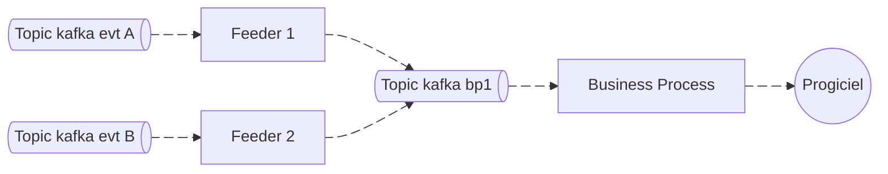
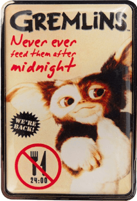

# Archi logicielle pour la replication de données avec kafka

A la [MAIF](https://maif.github.io/) Je travail sur les données de connaissances de personnes. Ces données étaient gérées par un CRM du marché, un peu vieillissant.
Sur le coeur de métier, la MAIF a choisie le "build" à la place du "buy", sur ce périmètre, on remplace donc le CRM par un applicatif fait main, par une équipe d'artisans.

Une des taches, qui nous occupe pas mal, c'est de synchroniser les données, entre le CRM et notre applicatif, dans un sens ou dans l'autre.
Pour ce faire, nous avons mis en place une architecture logicielle que je vais présenter ici.

{/* truncate */}

## L'instant musical

<iframe width="560" height="315" src="https://www.youtube.com/embed/0OGuRBoxEOk?si=_MfMVC_VOG7QeAoy" title="YouTube video player" frameborder="0" allow="accelerometer; autoplay; clipboard-write; encrypted-media; gyroscope; picture-in-picture; web-share" referrerpolicy="strict-origin-when-cross-origin" allowfullscreen></iframe>

## Le context

Notre équipe récupère un domaine fonctionnel qui était géré dans un progiciel. Dans un premier temps, nous étions un réplica à 100% mais,
au fur et à mesure, nous prenons la main sur des morceaux du domaine, jusqu'à être en responsabilité de la totalité.

Les modèles de données ne sont pas tout à fait les mêmes des deux côtés, donc quand un événement arrive, il faut réaligner les modèles avant de créer ou mettre à jour les données.

Voici les points de vigilance concernant les synchros
* on ne veut pas créer de doublons
* on ne veut pas rater de synchros
* pour une même donnée, on ne veut pas de mise à jour concurrente (on risquerait de perdre des mises à jour)
* on veut tracer les problèmes

## L'architecture mise en place

Pour nos synchros, on a mis 2 typologies de composants :
* Les feeders
* Les business process

### Le business process

Le nom est probablement tout pourris mais bref, le but de ce composant est de gérer la réplication d'une entité / agrégat vers le système cible.
Ici on va gérer le fait de créer, modifier ou supprimer une donnée, le mapping, les conversions de données etc.

Ce composant prend en entrée un set de commandes qui pourront par exemple être représentées par un type union.

Le comportement classique serait :
* on appel l'api du système cible pour voir si la donnée existe
* si elle existe, on fait une mise à jour : annule et remplace ou maj partielle
* si elle n'existe pas, on fait une création

### Le feeder
 

Le feeder "nourrit" le business process, il capte des événements de différentes sources et a pour but de fabriquer les bonnes commandes pour le business process.
Le feeder positionne aussi la clé de sharding sur les messages kafka, c'est un élément important, dont on va parler tout de suite.

### Gestion de la concurrence

Un des problèmes lorsque nous synchronisons des données, c'est que des messages qui proviennent de topics différents peuvent déclencher au final, la mise à jour d'une même entité.
Les messages (ou événements) source, étant dans des topics différents, ou même des partitions différentes, seront surement consommés en parallèle.

Si ces messages déclenchent des mises à jour, on aura des mises à jour concurrentes et donc, probablement de la perte en ligne.

Dans kafka, sur les messages, on peut spécifier une clé. Cette clé sert à router les messages, et, de s'assurer que les messages avec la même clé seront consommés dans l'ordre.

Avec notre architecture, où les feeders produisent des commandes pour nos business process, en jouant sur la clé des messages, nous allons automatiquement réordonner les choses.
Toutes les mises à jour d'une même entité seront consommées dans l'ordre, le problème de mise à jour concurrente est résolue.

### Gestion des erreurs : Retry backoff et DL queue

### Gestion des doublons et idempotence

### Impact des mises à jour de masse

