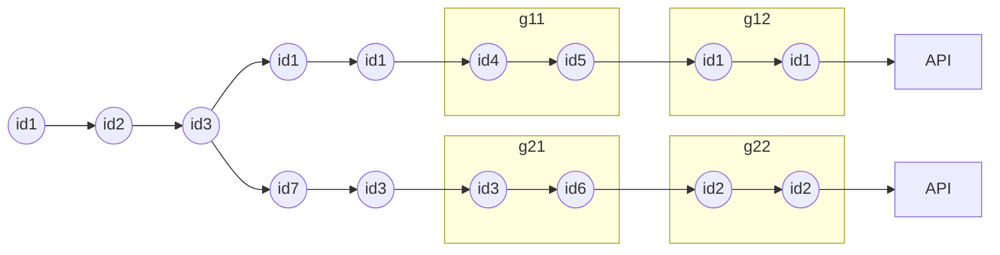

# Le sharding, un algo qui vous veut du bien !

Le sharding est un algo très utilisé dans le monde des systèmes distribués. C'est un algo assez simple, qui pourrait aussi vous aider dans vos développements de tous les jours.

{/* truncate */}

## L'instant musical

<iframe width="560" height="315" src="https://www.youtube.com/embed/h8WVBBGvwe4?si=68exYXcXNmXwxJJX" title="YouTube video player" frameborder="0" allow="accelerometer; autoplay; clipboard-write; encrypted-media; gyroscope; picture-in-picture; web-share" referrerpolicy="strict-origin-when-cross-origin" allowfullscreen></iframe>

## Le sharding

Le sharding sert à repartir des données ou des traitements uniformément.
Le cas d'école est le suivant : on a identifiants qu'on souhaite répartir vers des nœuds d'un cluster (ou bien des threads ou n'importe quoi).
Ce qu'on veut, c'est
* Pouvoir répartir uniformément les identifiants entre les nœuds du cluster
* S'assurer qu'un même identifiant ira toujours sur le même nœud

Comment on fait ça ?

Imaginons que nous avons 10 nœuds dans notre cluster et que nous avons les identifiants numérotés de 1 à 1000.
On pourrait se dire que les ids de 1 à 100 iront sur le nœud 1, de 101 à 200 sur le nœud 2, les id de 201 à 300 sur le nœud 3 etc.
Ça, c'est la version simple et facile, on va aller plus loins.

Quel que soit le nombre d'id, avec des id de type texte, on voudrait répartir uniformément les ids sur les nœuds.

Pour faire ça, on va
* utiliser une fonction de hachage : cette fonction va produire un hash à partir de l'id sous la forme d'un nombre
* le modulo du hash : hash % le nombre de nœuds = le numéro du nœud vers lequel router l'id

Pour un id `30d62f77-bb54-4b9a-962f-77bb541b9ae1`, si on a 10 nœuds et que :

`hash(id) % 10 = 5`

Alors, on enverra l'id sur le nœud numéro 5.

Il reste maintenant à trouver un algo de hachage qui, a une bonne répartition quelle que soit la chaîne de caractères en entrée. Et à priori, c'est `MurmurHash3` qui semble faire l'unanimité.

Voici via un test comment sont répartis des UUID :

```java
Map<Integer, Integer> repartition = List
        // On génère 10000 uuid
        .range(0, 10000).map(__ -> UUID.randomUUID().toString())
        .map(id -> {
            // Calcule du hash
            int hash = MurmurHash.stringHash(id);
            // On a 10 channels
            int num = Math.abs(hash % 10);
            return Tuple.of(num, hash, id);
        })
        // On groupe par le numéro du channel
        .groupBy(Tuple3::_1)
        // On compte les valeurs par channel
        .mapValues(Traversable::size);

System.out.println(repartition);
```

Résultat : on a environ 1000 éléments par channel, ça n'est pas trop mal

```
((5, 1030), (9, 1011), (1, 1032), (0, 971), (2, 1022), (6, 1007), (8, 995), (4, 948), (7, 1023), (3, 961))
```


## Qui utilise cet algorithme ?

Pas mal de systèmes distribués utilisent cet algorithme, ou bien une version améliorée.

Kafka utilise cet algo pour router les événements sur la bonne partition d'un topic.

Cassandra / dynamo DB utilise une [version plus évoluée](https://cassandra.apache.org/doc/latest/cassandra/architecture/dynamo.html) pour distribuer les données sur un cluster.

Elasticsearch utilise quelque chose de similaire pour assigner un document à un shard.

[Akka/Pekko Cluster](https://pekko.apache.org/docs/pekko/current/typed/cluster.html) utilise ça avec son module de [cluster sharding](https://pekko.apache.org/docs/pekko/current/typed/cluster-sharding.html).

## Comment utilise-t-on cet algorithme ?

Comme exemple d'utilisation de cet algorithme, on va prendre l'import d'un gros fichier csv. Dans le fichier à importer, il peut y avoir plusieurs lignes qui concernent la même donnée.

Pour que l'import ne soit pas trop lent, on va paralléliser l'import.


Ici, on commence à lire le fichier, on parallélise par 2, on fait des paquets de 2 pour faire des bulks updates vers l'API.


On voit vite le problème, les données avec les mêmes ids sont traités en parallèle, on va avoir des modifications concurrentes et donc on risque de perdre des mises à jour.

J'ai une idée ! Et si on utilisait le sharding !

Comme on parallélise par 2, on va faire :
`hash(id) % 2` pour savoir si on envoie l'id dans le channel 0 ou dans le channel 1. Attention, au moment des batchs updates, il faudra grouper les modifs d'un même id

Dans cet exemple :
* Dans le channel 0 on aura id1, id4, id5
* Dans le channel 1 on aura id2, id3, id6, id7



Voici un exemple en utilisant les flux de reactor :

```java
int parallelism = 10;
int bulkSize = 500;
readLinesFromFile("/folder/bigfile.csv")
        .map(Data::parse)
        .groupBy(data -> {
            int hash = MurmurHash.stringHash(data.id());
            int num = Math.abs(hash % parallelism);
            return num;
        })
        .flatMap(channelFlux -> {
            System.out.println("Je suis sur le channel " + channelFlux.key());
            return channelFlux
                    .buffer(bulkSize)
                    .concatMap(bulkInsert());
        })
        .subscribe();
```

### Autres idées d'utilisation

#### Répartir des jobs sur les nœuds d'un cluster

On veut scheduler des jobs sur un cluster avec un nombre de nœuds fixes, on génère un id pour les jobs et c'est parti !

#### Faire de l'AB testing

On veut présenter la feature `A` à 20% des utilisateurs, et la feature `B` aux 80% restant, pas de problème :

si `hash(id) % 100 < 20` c'est `A` sinon ça sera `B`. Comme le hash(id) aura toujours la même valeur, l'utilisateur aura toujours la même version.
Pas besoin de stocker d'état en base, c'est super simple !

## Conclusion

C'est un algo que j'utilise régulièrement quand je dois traiter de la donnée, il m'a aidé dans un paquet de situations, j'espère qu'il vous rendra aussi service !
