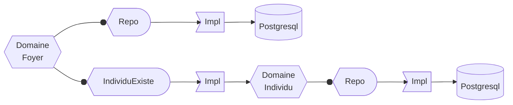
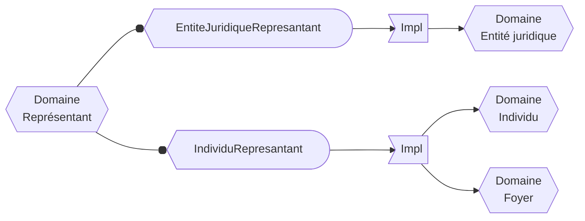

# DDD, architecture hexagonale et hive pattern

Cela fait quelques années déjà que je m'intéresse au DDD mais j'ai toujours l'impression d'être un débutant.
Même si j'utilise certains outils du DDD régulièrement dans mon travail, je ne me sens pas vraiment légitime à me considérer comme un pratiquant averti.

Dans notre équipe, nous gérons un "référentiel de personnes", comme ça, ça ne sonne pas trop DDD. Et justement, nos use cases, m'ont amenés pleins de questions et d'interrogations sur la façon d'aborder certaines problématiques à travers les concepts DDD.

{/* truncate */}

## L'instant musical

## Notre (nos) domaine(s)

À la MAIF, la connaissance de la personne et la relation client, c'est vraiment un sujet au premier plan.
Dans notre équipe, nous gérons un référentiel de personnes, dans lequel, on va stocker tout un tas de données qui font qu'un conseiller aura une bonne vision du sociétaire ou du client lorsqu'il devra intéragir avec lui.

On va y trouver :
* L'individu lui-même : son nom, prénom, civilité, téléphone, email, etc.
* Son foyer : permet d'avoir l'adresse de contact ainsi que des infos sur les membres de la famille (qui sont des individus) qui pourraient être couvert, car dans le même foyer.
* Les notions de représentation (tutelle, curatelle, habilitation familiale, succession) : en effet dans le cas d'une représentation, il faut intéragir avec le représentant.
* Les entités juridiques : Association et collectivité, les auto entrepreneurs, etc. Ces structures ont des interlocuteurs qui sont des individus.

Ici, on s'approche un peu du god modèle et on s'éloigne des principes DDD. L'individu est omniprésent dans plusieurs contextes différents : foyer, entités juridiques, représentation.

Il y a un moment, j'avais vu le talk de Grégory Weinbach ["Il n'y a pas de bon modèle métier"](https://www.youtube.com/watch?v=qN43Dy6fGkk) avec l'exemple du livre dans plusieurs contextes :
* du point de vue de l'auteur : une histoire, un nombre de pages, etc.
* du point de vue de l'imprimeur : un grammage, une police de caractères, etc.
* du point de vue du vendeur : un prix, un poids, etc.

Dans notre cas, est-ce que l'individu ne concentre pas trop de facette ? Quel est vraiment notre métier ? Notre domaine ?

Un point important, c'est que du point de vue des utilisateurs, les mêmes conseillers peuvent travailler sur toutes les typologies de données.
Un même conseiller peut gérer le dossier d'un individu dont l'assurance couvre les membres de son foyer puis,
passer sur le dossier d'un auto-entrepreneur puis,
passer sur le dossier de quelqu'un qui serait représenté par un autre individu ou pas une association comme l'UDAF.

C'est probablement le point qui me rassure le plus, vu que notre domaine est probablement un peu trop gros.

### La connaissance de la personne

À l'unanimité dans notre équipe, ce qui définit notre domaine, ce sont les données de connaissance de la personne. On ne gère pas une adresse de lieu de risque, mais une adresse de contact. On ne gère pas email de login, mais un email de contact, etc.

Ces données étaient stockées dans un CRM du marché, nous sommes en train de prendre la main dessus au fur et à mesure, périmètre de données, après périmètres de données. Au départ, nous avions une approche très CRUD, celle qui nous permettait facilement de répliquer les données d'un système à l'autre.
Au fur et à mesure qu'on prend la main sur un périmètre, on introduit du métier et un cycle de vie de la donnée.

On a défini 4 domaines :
* Les individus
* Les foyers avec leurs membres
* Les entités juridiques
* Les liens : lien de représentation, lien interlocuteur, lien de liquidation judiciaire, lien de société mère

Est-ce qu'on peut considérer l'individu, le foyer, l'entité juridique et les liens sont des agrégats ? Je ne sais pas encore...

## L'architecture logicielle

Depuis le départ, on a mis en place une architecture hexagonale. Perso, je ne suis pas trop à cheval sur le fait de respecter un pattern "by the book".
J'essaye plutôt de voir les problèmes que le pattern va résoudre et je vais ensuite m'approprier ce pattern et l'adapter à mon contexte. C'est un peu une façon nice de dire que c'est fait à l'arrache 😅.

Une discussion qui revient souvent, c'est le domaine doit-il être en java vanilla ? Est-ce que des frameworks peuvent transparaitre dans le domaine ?

Dans notre codebase, on utilise des frameworks reactifs, [wrappé dans un truc à nous](https://github.com/larousso/spring-reactif-code-metier), et donc ça devient visible dans toutes les signatures des méthodes du domaine. Pour le moment, on vit avec.
Par contre, tout ce qui est lié à la sérialisation json sera dans la partie infra, la config spring aussi.

Nous avons donc 4 hexagones, un pour chaque domaine : individus, foyers, entités juridiques et les liens. Les liens, c'est un peu le four tout, en réalité chaque lien est un domaine distinct.
Au niveau des ports, chaque hexagone a un port pour intéragir avec le stockage, et dans certain cas, on a des ports utilisés pour certaines règles de gestion.

Par exemple, si on doit créer un foyer avec des membres, on va vérifier que le membre existe bien :

Quand on a commencé à prendre le lead sur certains morceaux de données et à ne plus seulement être un réplica, mais à devenir maitre de la donnée, des backend for frontend ont commencé à nous appeler.
Là où, on avait une approche CRUD pour faire de la replication système à système, on a commencé à intégrer une vision des choses plus métier et donc à former de nouveaux regroupements de données.

Par exemple, pour créer une représentation de tutelle, il faut créer :
* Le représentant :
    * Soit une entité juridique : par UDAF
    * Soit un individu et son foyer
* Le lien de représentation

On a donc un nouveau domaine qui apparait avec 2 ports `EntiteJuridiqueRepresantant` et `IndividuRepresantant`

Un autre aspect, c'est qu'ici, on passe le contexte transactionnel de bout en bout. On a donc une sorte de nouvel agrégat du pauvre.

Au départ, nous n'avions pas créé des nouveaux domaines, juste des méthodes supplémentaires dans les domaines existants, c'était un peu le bazar. C'est à la suite du visionnage du très bon talk de Thomas Pierrain et Julien Topçu sur le hive pattern, qu'on a réarrangé les choses pour clairement faire ressortir les nouveaux domaines.
