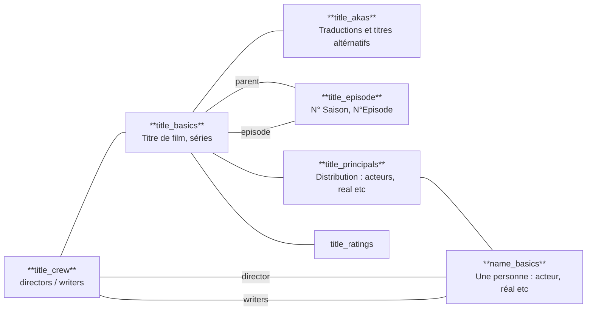

J'aime bien le sql et donc je n'aime pas trop les ORMs, et même un peu plus.
Comme râler n'est pas très constructif, dans cet article,
je vous propose une solution pour exécuter des queries graphql sans ORM, en écrivant du sql.

{/* truncate */}

## L'instant musical

<iframe width="560" height="315" src="https://www.youtube.com/embed/JK_hBk2f01k?si=YS5EUxqi2j2KCByp" title="YouTube video player" frameborder="0" allow="accelerometer; autoplay; clipboard-write; encrypted-media; gyroscope; picture-in-picture; web-share" referrerpolicy="strict-origin-when-cross-origin" allowfullscreen></iframe>

## Le use case

Pour illustrer cet article, je suis parti de la base de données [IMDB](https://www.imdb.com/fr/).

Tout le code se trouve dans le repo https://github.com/larousso/spring-graphql-plain-sql

Le modèle de données qui nous intéresse ressemble à :



L'import des données est fait avec le fichier https://github.com/larousso/spring-graphql-plain-sql/blob/main/import-data.sh depuis le site IMDB

Pour créer le jeu de données, après avoir cloné le repository :
* `docker-compose up`
* `sh import-data.sh`

Pour les gens sous windows, vous pouvez tenter en vous connectant à l'image postgresql, avec un peu de chance ça passe !

## Graphql

Graphql est un langage de requêtage pour les APIs. On décrit notre modèle de données grâce à un schéma qui sert également de documentation.
Le client peut ensuite écrire des requêtes à partir du schéma et choisir les données qu'il souhaite récupérer.

Pour notre use-case, on veut exposer des `Titres` de films ou de séries.

Pour un `Titre`, on veut récupérer
* Les épisodes si c'est une série
* La distribution : acteurs, réalisateurs etc

La petite difficulté, c'est que pour chaque `Acteur`, on veut pouvoir avoir ses `Titres` principaux, voir tous ses `Titres`
et que pour ses `Titres`, on veut les `Acteurs` et que pour chaque `Acteur`, on veut ses `Titres`, AAAAHHHHHH.

</img>

Bref commençons à décrire le schéma :

```graphql
type Query {
    titles(name: String, type: TitleType, page: Int, size: Int): [Title]
}

scalar LocalDate
scalar LocalDateTime
scalar Year

type Title {
    id: ID
    titleType: TitleType
    primaryTitle: String
    originalTitle: String
    startYear: Year
    endYear: Year
    genres: [String]
    distribution: [Role]
    episodes: [Episode]
}

type Role {
    id: ID
    category: String
    job: String
    characters: [String]
    person: Person
}


type Episode {
    seasonNumber: Int
    episodeNumber: Int
    show: Title
}

type Person {
    primaryName: String
    birthYear: LocalDate
    deathYear: LocalDate
    primaryProfession: [String]
    titles(type: TitleType): [Title]
    knownFor: [Title]
}

enum TitleType {
    movie
    short
    tvEpisode
    tvMiniSeries
    tvMovie
    tvPilot
    tvSeries
    tvShort
    tvSpecial
    video
    videoGame
}
```

Dans ce schéma, on expose une `querie`, qui nous permet de rechercher des `Titres`.

Ici, on propose 2 critères de filtre, `name` et `type`. On expose aussi de la pagination pour ne pas remonter trop de données à chaque fois.


```graphql
type Query {
    titles(name: String, type: TitleType, page: Int, size: Int): [Title]
}
```

:::warning
La pagination est faite de façon naïve, ça n'est pas le sujet de l'article.
:::


On décrit ensuite des "scalar", en gros, nos propres types primitifs :
```graphql
scalar LocalDate
scalar LocalDateTime
scalar Year
```

Enfin notre `Title`, qui a un `cast`, une liste de `Role` et des `episodes` (`Episode`)

```graphql
type Title {
    id: ID
    titleType: TitleType
    primaryTitle: String
    originalTitle: String
    startYear: Year
    endYear: Year
    genres: [String]
    cast: [Role]
    episodes: [Episode]
}
```

Notre `Role` pointe vers une `Person` qui expose une liste de `Title` :

```graphql
type Role {
    id: ID
    category: String
    job: String
    characters: [String]
    person: Person
}

type Person {
    primaryName: String
    birthYear: LocalDate
    deathYear: LocalDate
    primaryProfession: [String]
    titles(type: TitleType): [Title]
    knownFor: [Title]
}
```

Notre `Episode` pointe à nouveau vers un `Title` :

```graphql
type Episode {
    seasonNumber: Int
    episodeNumber: Int
    show: Title
}
```

### Notre première query

Si on veut récupérer le film "The First Slam Dunk" ainsi que la distribution du film, on peut écrire une requête de cette forme :

```graphql
query MyQuery {
  titles(name: "The First Slam Dunk", type: movie) {
    originalTitle
    primaryTitle
    startYear
    genres
    cast {
      category
      characters
      person {
        primaryName
        primaryProfession
      }
    }
  }
}
```

On aura le résultat suivant :

```json
{
  "data": {
    "titles": [
      {
        "originalTitle": "The First Slam Dunk",
        "primaryTitle": "The First Slam Dunk",
        "startYear": 2022,
        "genres": [
          "Animation",
          "Comedy",
          "Drama"
        ],
        "cast": [
          {
            "category": "actor",
            "characters": [
              "Ryôta Miyagi"
            ],
            "person": {
              "primaryName": "Shugo Nakamura",
              "primaryProfession": [
                "actor",
                "archive_sound"
              ]
            }
          },
          {
            "category": "actor",
            "characters": [
              "Hisashi Mitsui"
            ],
            "person": {
              "primaryName": "Jun Kasama",
              "primaryProfession": [
                "actor"
              ]
            }
          },
          ...
        ]
      }
    ]
  }
}
```

## Le backend

Pour le backend, on va utiliser spring graphql et jooq pour nous faciliter l'écriture du SQL.

Dans spring graphql, le pendant de

```graphql
type Query {
    titles(name: String, type: TitleType, page: Int, size: Int): [Title]
}
```

Devient :

```java
import java.util.List;@Controller
public class GraphQlController {

    @QueryMapping
    public List<Title> titles(@Argument String name,
                              @Argument TitleType type,
                              @Argument Integer page,
                              @Argument Integer size,
                              DataFetchingEnvironment dataFetchingEnvironment) {
        // TODO
        return List.of();
    }
}
```

Il reste maintenant à récupérer les données.

## Requêtage postgresql

Quand on regarde la requête graphql suivante :

```graphql
query MyQuery {
  titles(name: "Severance", page: 1, size: 10, type: tvSeries) {
    primaryTitle
    genres
    titleType
    cast {
      category
      job
      person {
        primaryName
        birthYear
        primaryProfession
      }
    }
    episodes {
      seasonNumber
      episodeNumber
      show {
        primaryTitle
        originalTitle
      }
    }
  }
}
```

On peut voir une analogie avec du SQL :
* `titles(name: "Severance", page: 1, size: 10, type: tvSeries)` ce sont les critères de filtre, ça correspond au `WHERE` dans une requête SQL
* `{ primaryTitle genres ... }` ce sont les données que l'on souhaite en retour, ça correspond au `SELECT` dans une requête SQL

En version simplifiée, ça donnerait :

```sql
select *
from title_basics t
where
    t."originalTitle" = ? and
    t."titleType" = ?
offset ? limit ?
```

Il reste maintenant à écrire le select, et pour ça, on va utiliser les fonctionnalités json de postgresql.

Tout d'abord, on va commencer par transformer chaque ligne de la table `title_basics` en json en utilisant la fonction `row_to_json` :

```sql
select row_to_json(t)
from title_basics t
where
    t."originalTitle" = ? and
    t."titleType" = ?
offset ? limit ?
```

Cette requête produit pour chaque ligne un objet json avec pour clé le nom de la colonne et pour valeur la colonne.

Cette requête :

```sql
select row_to_json(t)
from title_basics t
where t."originalTitle" = 'The First Slam Dunk' and
    t."titleType" = 'movie'
offset 0 limit 10;
```

Produit le résultat suivant :

```json
{
  "tconst": "tt15242330",
  "titleType": "movie",
  "primaryTitle": "The First Slam Dunk",
  "originalTitle": "The First Slam Dunk",
  "isAdult": false,
  "startYear": 2022,
  "endYear": null,
  "runtimeMinutes": 124,
  "genres": [
    "Animation",
    "Comedy",
    "Drama"
  ]
}
```

Maintenant, on aimerait également récupérer les épisodes, quand c'est une série, ainsi que le casting.
Pour ça, on va aussi utiliser des fonctions json.

L'idée est de faire un "sous select" :

```sql
select row_to_json(tb)::jsonb ||
    jsonb_build_object(
            'cast', array(
                select row_to_json(tp)::jsonb ||
                       jsonb_build_object('person', row_to_json(nb))
                from title_principals tp
                 join name_basics nb on nb.nconst = tp.nconst
                where tp.tconst = tb.tconst
            ),
            'episodes', array(
                select row_to_json(tbe)
                from title_episode te
                join title_basics tbe on tbe.tconst = te.const
                where te."parentTconst" = tb.tconst
            )
    )
from title_basics tb
where tb."originalTitle" = 'The First Slam Dunk' and
        tb."titleType" = 'movie'
limit 10;
```

Faisons une analyse de texte !

Tout d'abord l'opérateur `||` permet de merger 2 objets json ensemble.

On a ensuite `jsonb_build_object` qui permet de faire son propre objet json.
`jsonb_build_object` prend une série de clés / valeur : `jsonb_build_object('cle1', valeur1, 'cle2', valeur2, ...)`.

À noter que `||` ne fonctionne que sur un type `jsonb` (du json binaire) et non sur le type `json`.
Pour merger le `row_to_json` avec `jsonb_build_object`, il faut passer par une opération de cast `row_to_json(tb)::jsonb` :

```sql
select row_to_json(tb)::jsonb ||
    jsonb_build_object('cast', ...)
...
```

Il reste maintenant à compléter la valeur. Ici, on veut récupérer les membres du casting :

```sql
select row_to_json(tp)::jsonb ||
       jsonb_build_object('person', row_to_json(nb))
from title_principals tp
join name_basics nb on nb.nconst = tp.nconst
where tp.tconst = tb.tconst
```
Même chose que pour les titres, on utilise `row_to_json` pour fabriquer la sortie json.

Dans le schéma graphql, on avait également la `Person` :

```graphql
type Role {
    id: ID
    category: String
    job: String
    characters: [String]
    person: Person
}
```

On récupère la personne à partir de la table `name_basics` et comme précédemment, on va merger avec l'opérateur `||` :

```sql
select row_to_json(tp)::jsonb || jsonb_build_object('person', row_to_json(nb))
```

Tout ça mis bout à bout, avec en plus le requêtage des épisodes, on obtient :

```sql
select row_to_json(tb)::jsonb ||
    jsonb_build_object(
            'cast', array(
                select row_to_json(tp)::jsonb ||
                       jsonb_build_object('person', row_to_json(nb))
                from title_principals tp
                 join name_basics nb on nb.nconst = tp.nconst
                where tp.tconst = tb.tconst
            ),
            'episodes', array(
                select row_to_json(tbe)
                from title_episode te
                join title_basics tbe on tbe.tconst = te.const
                where te."parentTconst" = tb.tconst
            )
    )
from title_basics tb
where tb."originalTitle" = 'The First Slam Dunk' and
        tb."titleType" = 'movie'
limit 10;
```

### Intégration dans springboot

Pour l'intégration de cette reqête dans springboot, on va utiliser jooq.
Jooq propose plusieurs altérnatives, on peut aller d'un builder de query typesafe à des requêtes sous forme de texte, voir mixer tout ça ensemble.

Ici, on va utiliser la version texte. On va avoir un repository qui ressemble à :

```java
@Component
public class TitleRepository {

    private final ObjectMapper mapper;
    private final DSLContext dsl;

    public TitleRepository(ObjectMapper mapper, DSLContext dsl) {
        this.mapper = mapper;
        this.dsl = dsl;
    }

    public List<Title> titles(String name, TitleType type, Integer page, Integer size) {
        return this.dsl
                .resultQuery("""
                    select row_to_json(tb)::jsonb ||
                        jsonb_build_object(
                                'cast', array(
                                    select row_to_json(tp)::jsonb ||
                                           jsonb_build_object('person', row_to_json(nb))
                                    from title_principals tp
                                     join name_basics nb on nb.nconst = tp.nconst
                                    where tp.tconst = tb.tconst
                                ),
                                'episodes', array(
                                    select row_to_json(tbe)
                                    from title_episode te
                                    join title_basics tbe on tbe.tconst = te.const
                                    where te."parentTconst" = tb.tconst
                                )
                        )
                    from title_basics t
                    where t."originalTitle" = {0} and
                            t."titleType" = {1}
                    offset {2}
                    limit {3}
                    """,
                        name,
                        type.name(),
                        (Objects.requireNonNullElse(page, 1) - 1) * Objects.requireNonNullElse(size, 20),
                        size
                )
                .fetch(0, JSONB.class)
                .stream().map(this::fromJson)
                .toList();
    }


    Title fromJson(JSONB json) {
        try {
            return mapper.readValue(json.data(), Title.class);
        } catch (JsonProcessingException e) {
            throw new RuntimeException(e);
        }
    }
}
```

Jooq permet de faire des requêtes paramétrées en remplaçant `{0}`, `{1}` etc par les valeurs en paramètre de `resultQuery`.

On peut maintenant brancher notre repository dans notre controller :

```java
@QueryMapping
    public List<Title> titles(@Argument String name,
                              @Argument TitleType type,
                              @Argument Integer page,
                              @Argument Integer size,
                              DataFetchingEnvironment dataFetchingEnvironment) {
        return titleRepository.titles(name, type, page, size);
    }
```

Et voilà, on a notre query graphql !!!

Le problème, c'est qu'on remonte le casting et les épisodes tout le temps alors que le client ne les a pas demandés.

On pourrait paramétrer la query pour ne requêter que le simple nécessaire. Pour ça on va utiliser l'objet `DataFetchingEnvironment` :

```sql
@QueryMapping
public List<Title> titles(@Argument String name,
                          @Argument TitleType type,
                          @Argument Integer page,
                          @Argument Integer size,
                          DataFetchingEnvironment dataFetchingEnvironment) {
    boolean queryCast = dataFetchingEnvironment.getSelectionSet().contains("cast");
    boolean queryEpisodes = dataFetchingEnvironment.getSelectionSet().contains("episodes");
    return titleRepository.titles(name, type, page, size, queryCast, queryEpisodes);
}
```

Notre repository devient alors :

```java
public List<Title> titles(String name, TitleType type, Integer page, Integer size, boolean queryCast, boolean queryEpisode) {
    return this.dsl
            .resultQuery("""
                select
                    row_to_json(t)::jsonb ||
                        jsonb_build_object(
                            'cast', {0},
                            'episodes', {1}
                        )
                from title_basics t
                where t."originalTitle" = {2} and
                        t."titleType" = {3}
                offset {4} limit {5}
                """,
                    castQuery(queryCast),
                    episodesQuery(queryEpisode),
                    name,
                    type.name(),
                    (Objects.requireNonNullElse(page, 1) - 1) * Objects.requireNonNullElse(size, 20),
                    size
            )
            .fetch(0, JSONB.class)
            .stream().map(this::fromJson)
            .toList();
}

Field<JSONB> castQuery(boolean queryCast) {
    if (queryCast) {
        return field("""
                array(
                    select row_to_json(tp)::jsonb ||
                        jsonb_build_object('person', row_to_json(nb))
                    from title_principals tp
                     join name_basics nb on nb.nconst = tp.nconst
                    where tp.tconst = t.tconst
                )
                """, JSONB.class);
    } else {
        return field("""
                json_build_array()
                """, JSONB.class);
    }
}

Field<JSONB> episodesQuery(boolean queryEpisodes) {
    if (queryEpisodes) {
        return field("""
                array(
                    select row_to_json(te)::jsonb ||
                        jsonb_build_object('show', row_to_json(tbe))
                    from title_episode te
                    join title_basics tbe on tbe.tconst = te.const
                    where te."parentTconst" = t.tconst
                )
                """, JSONB.class);
    } else {
        return field("""
                json_build_array()
                """, JSONB.class);
    }
}
```

Cool, on a optimisé notre requête !!!

## Requêter en profondeur

Que se passe-t-il, si l'utilisateur formule cette requête :

```graphql
query MyQuery {
  titles(name: "Severance", page: 1, size: 10, type: tvSeries) {
    primaryTitle
    genres
    titleType
    cast {
      category
      job
      person {
        primaryName
        birthYear
        primaryProfession
        knownFor {
          titleType
          primaryTitle
        }
        titles(type: movie) {
          titleType
          primaryTitle
        }
      }
    }
    episodes {
      seasonNumber
      episodeNumber
      show {
        primaryTitle
        originalTitle
      }
    }
  }
}
```

En l'état, il manquera pour chaque personne, les titres pour lesquelles elle est connue, ainsi que la liste de tous les titres auxquelles elle a participé.

Nous allons étudier 3 solutions
* lever une erreur
* Utiliser l'annotation `@ShemaMapping`
* Utiliser l'annotation `@BatchMapping`
* YOLO : on fait tout en SQL

### Lever une erreur

La solution la plus simple : lever une erreur !

Dans ce cas, on invite l'utilisateur à formuler une requête moins complexe, ça fonctionne, mais c'est déceptif.

Il existe des mécanismes clé en main : https://www.graphql-java.com/documentation/instrumentation


### Utiliser l'annotation `@SchemaMapping`

L'annotation `@SchemaMapping` permet de "prendre la main" sur certaines propriétés.

Pour récupérer les titres et les titres connus d'une personne, on peut ajouter les 2 méthodes suivantes dans le controller :

```java
@SchemaMapping
public List<Title> titles(Person person, @Argument TitleType type) {
    return titleRepository.titlesByPersonsAndType(person.nconst(), type);
}


@SchemaMapping
public List<Title> knownFor(Person person) {
    return titleRepository.titlesKnownForByPersons(person.nconst());
}
```

Cette approche fonctionne très bien, mais, elle a un inconvenient : on fait une requête à la base par personne et par champs.

Ceci peut avoir des impacts d'un point de vue temps de réponse et sollicitation à la base.

### Utiliser l'annotation `@BatchMapping`

L'annotation `@BatchMapping`, est un short cut vers la notion de `BatchLoader` présent dans la lib `graphql-java` sur laquelle s'appuie spring.

L'idée, ici, c'est de collecter toutes les personnes pour lesquelles on souhaite récupérer des données. On va ensuite tout requêter d'un coup :

```java

@BatchMapping
public Map<Person, List<Title>> titles(List<Person> persons /*Les personnes pour lesquelles on souhaite récupérer les titres*/) {
    Map<String, List<Person>> personById = persons.stream().collect(Collectors.groupingBy(p -> p.nconst()));
    // On requête tout d'un coup :
    return titleRepository.titlesByPersons(persons.stream().map(p -> p.nconst())
            .collect(Collectors.toList()))
            .entrySet().stream().collect(Collectors.toMap(
                    entry -> personById.get(entry.getKey()).get(0),
                    entry -> entry.getValue()
            ));
}

@BatchMapping
public Map<Person, List<Title>> knownFor(List<Person> personList) {
    Map<String, List<Person>> personById = personList.stream().collect(Collectors.groupingBy(p -> p.nconst()));
    return titleRepository.titlesKnowForByPersons(personList.stream().map(p -> p.nconst())
            .collect(Collectors.toList()))
            .entrySet().stream().collect(Collectors.toMap(
                    entry -> personById.get(entry.getKey()).get(0),
                    entry -> entry.getValue()
            ));
}
```

Le souci de cette approche, c'est qu'il n'est pas évident d'appliquer des filtres comme pour les `titles` :

```graphql
type Person {
    ..
    titles(type: TitleType): [Title]
    ...
}
```

Il existe des issues de documentation et de faisabilité :

https://github.com/spring-projects/spring-graphql/issues/1168
https://github.com/spring-projects/spring-graphql/issues/232

### Full SQL !

Dans l'ensemble les solutions précédentes sont grosso modo suffisantes.
Sur notre projet actuel, nous utilisons la première solution, les utilisateurs gourmands en données payent le coût des temps de réponse.

Comme je suis joueur, je me suis demandé comment faire pour ne générer qu'une seule requête à partir de la query graphql ?

Eh bien voici une proposition de solution, attention, le code devient un peu plus compliqué !

Tout d'abord, commençons par ce que nous propose `graphl-java` avec `DataFetchingEnvironment.getSelectionSet` qui nous retourne un `DataFetchingFieldSelectionSet`, un objet qui décrit la requête formulée par l'utilisateur.

Cet objet expose la méthode `getFields` qui retourne une liste de `SelectedField` qui eux même ont une méthode `getFields` etc.

Chaque `SelectedField` expose un certain nombre d'accesseurs :
* `getName` : nom de l'attribut
* `getArguments` : avec les critères de filtre s'il y a
* `getLevel` : le niveau de profondeur du noeud
* `getType` : le type retourné
* etc

Maintenant, on va devoir générer le select de notre requête SQL récursivement en s'appuyant sur nos `SelectedField`.

On va partir de cette interface :

```java
public sealed interface QueryNode {
    Field<JSONB> select(Field<String> selectAlias);
}
```

On va ensuite créer une structure à l'image de notre schéma graphql :

```java
public sealed interface QueryNode {

    Field<JSONB> select(Field<String> selectAlias);

    record TitleNode(Integer level, RoleNode castNode, EpisodeNode episodeNode) implements QueryNode { ... }
    record EpisodeNode(Integer level, TitleNode titleNode) implements QueryNode { ... }
    record PersonNode(Integer level, TitleNode personKnownFor, TitleNode personTitles, TitleType type) implements QueryNode { ... }
    record RoleNode(Integer level, PersonNode personNode) implements QueryNode { ... }
}
```

Chaque nœud va pouvoir générer un morceau du select, pour constituer à la fin le select complet.

Le nœud courant va passer l'alias au nœud enfant pour qu'il génère le contenu et ainsi de suite.

Pour le nœud `Title`, on aura quelque chose comme ça :

```java
record TitleNode(Integer level, RoleNode castNode, EpisodeNode episodeNode) implements QueryNode {
    @Override
    public Field<JSONB> select(Field<String> selectAlias) {

        Field<JSONB> castField = Optional.ofNullable(castNode).map(n -> {
            // Si le casting doit être remonté, on va générer un morceau de requête ...
            // On fabrique, un alias à partir du level :
            Field<String> castAlias = field("cast"+level, String.class);
            // On retourne le morceau de select :
            return field("""
                    jsonb_build_object('cast', array_to_json(array(
                        select {0}
                        from title_principals {1}
                        where {1}.tconst = {2}.tconst
                    )))
                    """, JSONB.class,
                    // Ici on génère le select du titre en passant l'alias courant au noeud
                    n.select(castAlias),
                    castAlias,
                    selectAlias
            );
        })
        // Si pas noeud, on retourne un objet json avec rien dedans :
        .orElse(field("""
                jsonb_build_object('cast', json_build_array())""", JSONB.class)
        );

        // Même mécanisme pour les épisodes
        Field<JSONB> episodeField = Optional.ofNullable(episodeNode).map(episode -> {
            Field<String> epAlias = field("ep"+level, String.class);
            return field("""
                jsonb_build_object('episodes', array_to_json(array(
                    select {0}
                    from title_episode {1}
                    where {1}."parentTconst" = {2}.tconst
                )))
                """, JSONB.class, episode.select(epAlias), epAlias, selectAlias);
        }).orElse(field("""
                jsonb_build_object('episodes', json_build_array())""", JSONB.class));

        // A la fin on retourne le morceau de select d'un Titre qui se compose :
        // Du titre, du cast et des episodes :
        return field("""
                row_to_json({0})::jsonb ||
                {1} ||
                {2}
                """, JSONB.class, selectAlias, castField, episodeField);
    }
}
```

On voit que jooq nous aide bien pour construire la requête.

Les autres nœuds fonctionnent de la même façon, le code est visible [ici](https://github.com/larousso/spring-graphql-plain-sql/blob/main/src/main/java/fr/larousso/graphql/repository/QueryNode.java).

Dernière étape, créer nos nœuds à partir des `SelectedField` graphql. On va encore utiliser la récursivité :

```java
private static TitleNode createTitle(Integer level, List<SelectedField> selectedFields) {
    Optional<SelectedField> cast = selectedFields.stream().filter(f -> f.getName().equals("cast")).findFirst();
    Optional<SelectedField> episodes = selectedFields.stream().filter(f -> f.getName().equals("episodes")).findFirst();
    return new TitleNode(level,
            cast.map(c -> createCast(c.getLevel(), c.getSelectionSet().getFields())).orElse(null),
            episodes.map(c -> createEpisodes(c.getLevel(), c.getSelectionSet().getFields())).orElse(null)
    );
}

private static RoleNode createCast(Integer level, List<SelectedField> selectedFields) {
    Optional<SelectedField> person = selectedFields.stream().filter(f -> f.getName().equals("person")).findFirst();
    return new RoleNode(level, person.map(c -> createPerson(c.getLevel(), c.getSelectionSet().getFields())).orElse(null));
}

private static EpisodeNode createEpisodes(Integer level, List<SelectedField> selectedFields) {
    Optional<SelectedField> show = selectedFields.stream().filter(f -> f.getName().equals("show")).findFirst();
    return new EpisodeNode(level, show.map(c -> createTitle(c.getLevel(), c.getSelectionSet().getFields())).orElse(null));
}

private static PersonNode createPerson(Integer level, List<SelectedField> selectedFields) {
    Optional<SelectedField> titles = selectedFields.stream().filter(f -> f.getName().equals("titles")).findFirst();
    Optional<SelectedField> knownFor = selectedFields.stream().filter(f -> f.getName().equals("knownFor")).findFirst();
    return new PersonNode(
            level,
            knownFor.map(c -> createTitle(c.getLevel(), c.getSelectionSet().getFields())).orElse(null),
            titles.map(c -> createTitle(c.getLevel(), c.getSelectionSet().getFields())).orElse(null),
            titles.map(t -> (TitleType) t.getArguments().get("type")).orElse(null)
    );
}
```

On peut maintenant créer notre hiérarchie de nœuds à partir d'un `DataFetchingFieldSelectionSet` :

```java
static QueryNode create(DataFetchingFieldSelectionSet dataFetchingFieldSelectionSet) {
    return createTitle(1, dataFetchingFieldSelectionSet.getFields());
}
```

Et enfin la query finale à postgresql :

```java
public List<Title> titles(String name, TitleType type, Integer page, Integer size, DataFetchingFieldSelectionSet environment) {
    QueryNode queryNode = QueryNode.create(environment);
    return this.dsl
            .resultQuery("""
                select {0}
                from title_basics t
                where t."originalTitle" = {1} and
                        t."titleType" = {2}
                offset {3} limit {4}
                """,
                    queryNode.select(field("t", String.class)),
                    name,
                    type.name(),
                    (Objects.requireNonNullElse(page, 1) - 1) * Objects.requireNonNullElse(size, 20),
                    size
            )
            .fetch(0, JSONB.class)
            .stream().map(this::fromJson)
            .toList();
}
```

Le controller graphql devient très simple :

```java
@QueryMapping
public List<Title> titles(@Argument String name,
                          @Argument TitleType type,
                          @Argument Integer page,
                          @Argument Integer size,
                          DataFetchingEnvironment dataFetchingEnvironment) {
    return titleRepository.titles(name, type, page, size, dataFetchingEnvironment.getSelectionSet());
}
```

Voyons maintenant la requête postgresql générée pour une requête graphql.

Tout à l'heure, on avait cette requête graphql :

```graphql
query MyQuery {
  titles(name: "Severance", page: 1, size: 10, type: tvSeries) {
    primaryTitle
    genres
    titleType
    cast {
      category
      job
      person {
        primaryName
        birthYear
        primaryProfession
        knownFor {
          titleType
          primaryTitle
        }
        titles(type: movie) {
          titleType
          primaryTitle
        }
      }
    }
    episodes {
      seasonNumber
      episodeNumber
      show {
        primaryTitle
        originalTitle
      }
    }
  }
}
```

Eh bien, on obtient la requête sql suivante :

```sql
select row_to_json(t)::jsonb ||
       jsonb_build_object('cast', array_to_json(array(
               select row_to_json(cast1)::jsonb ||
                      jsonb_build_object('person', (
                          select row_to_json(p2)::jsonb ||
                                 jsonb_build_object('knownFor', array(
                                         select row_to_json(tb3)::jsonb ||
                                                jsonb_build_object('cast', json_build_array()) ||
                                                jsonb_build_object('episodes', json_build_array())
                                         from name_basics nb3
                                         cross join LATERAL UNNEST(nb3."knownForTitles") known3(tconst)
                                         join title_basics tb3 on tb3.tconst = known3.tconst
                                         where nb3.nconst = p2.nconst
                                                                ))
                                     ||
                                 jsonb_build_object('titles', array(
                                         select row_to_json(tb3)::jsonb ||
                                                jsonb_build_object('cast', json_build_array()) ||
                                                jsonb_build_object('episodes', json_build_array())
                                         from title_principals tp3
                                         join title_basics tb3 on tp3.tconst = tb3.tconst
                                         where tp3.nconst = p2.nconst and tb3."titleType" = 'movie'
                                 ))
                          from name_basics p2
                          where p2.nconst = cast1.nconst
                      ))
               from title_principals cast1
               where cast1.tconst = t.tconst
       ))) ||
       jsonb_build_object('episodes', array_to_json(array(
               select row_to_json(ep1)::jsonb ||
                      jsonb_build_object('show', (
                          select row_to_json(te2)::jsonb ||
                                 jsonb_build_object('cast', json_build_array()) ||
                                 jsonb_build_object('episodes', json_build_array())

                          from title_basics te2
                          where te2.tconst = ep1.const
                      ))
               from title_episode ep1
               where ep1."parentTconst" = t.tconst
        )))
from title_basics t
where t."originalTitle" = 'Severance' and
    t."titleType" = 'tvSeries'
offset 0 limit 10
```

Dernier aspect : la testabilité !

Il n'est pas forcément évident de bosser avec des `SelectedFields` dans les tests. Pour ça, j'ai écrit un petit boût de code boiler plate qui permet d'avoir le `DataFetchingEnvironment` pour une requête graphql donnée.

Le code se trouve [ici](https://github.com/larousso/spring-graphql-plain-sql/blob/main/src/test/java/fr/larousso/graphql/GraphqlHelper.java) et il est utilisable ainsi :

```java
 @Test
public void testQueryNode() {
    QueryNode queryNode = captureDataFetchingEnvironmentForQuery("""
            query MyQuery {
              titles(name: "Severance", page: 1, size: 10, type: tvSeries) {
                primaryTitle
                genres
                titleType
                cast {
                  category
                  job
                  person {
                    primaryName
                    birthYear
                    primaryProfession
                    knownFor {
                      titleType
                      primaryTitle
                    }
                    titles(type: movie) {
                      titleType
                      primaryTitle
                    }
                  }
                }
                episodes {
                  seasonNumber
                  episodeNumber
                  show {
                    primaryTitle
                    originalTitle
                  }
                }
              }
            }
            """, d -> QueryNode.create(d.getSelectionSet()));

    assertThat(queryNode).isEqualTo(
            new QueryNode.TitleNode(
                    1,
                    new QueryNode.RoleNode(
                            2,
                            new QueryNode.PersonNode(
                                3,
                                new QueryNode.TitleNode(4, null, null),
                                new QueryNode.TitleNode(4, null, null),
                                TitleType.movie
                            )
                    ),
                    new QueryNode.EpisodeNode(
                            2,
                            new QueryNode.TitleNode(3, null, null)
                    )
            ));
}
```

## Conclusion

Je vous ai présenté 3 approches qui peuvent d'ailleurs êtres complémentaires (surtout les 2 premières).

Les approches proposées ne sont d'ailleurs pas des approches propres au fait de faire du SQL, mais bien des stratégies de résolution de query graphql.
En JPA, on serait probablement confronté aux mêmes types de problématiques.

L'utilisation des features JSON de posgtresql sont très pratiques pour ces genres de usecases et permettent de très simplement de gérer les aspects de pagination, filtres etc.

La dernière proposition (full SQL) est la plus complexe, mais probablement la plus performante.

A vous de faire votre choix !