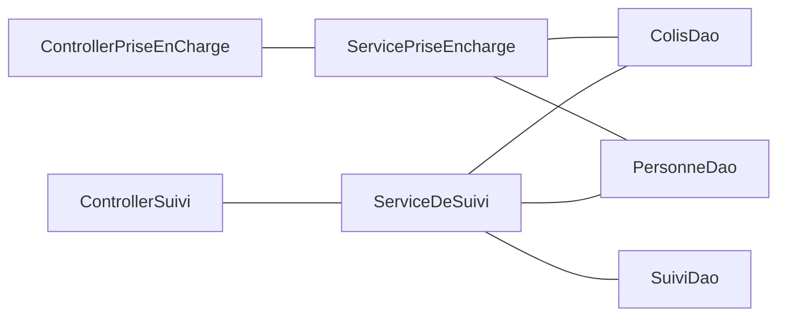
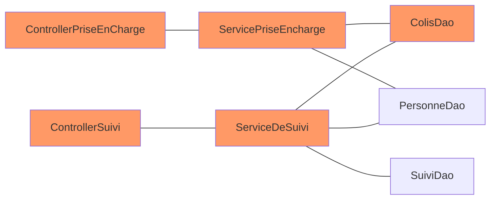

L'architecture hexagonale est probablement mon défaut que je setup un projet.
Quand on suit certaines précos, cette architecture peut sembler intimidante et compliquée, au point que se dit tanpis, je vais commencer simplement / autrement, et on verra après.

Moi, je pense qu'au contraire, on peut commencer en archi hexa de façon simple et monter en puissance ensuite.
Et même si on fait quelques entorses, ça sera toujours mieux que de ne pas le faire.

{/* truncate */}


## L'instant musical

<iframe width="560" height="315" src="https://www.youtube.com/embed/52JhiwsjVkg?si=fFMGLEWu-ti7Olam" title="YouTube video player" frameborder="0" allow="accelerometer; autoplay; clipboard-write; encrypted-media; gyroscope; picture-in-picture; web-share" referrerpolicy="strict-origin-when-cross-origin" allowfullscreen></iframe>

## Le cas métier

Pour illustrer le sujet, on va partir d'une boite de livraison, hubert claude, qui livre des colis et qui tourne dans le cloud.

On a en gros 2 modules

## L'archi n-tiers et ses problèmes

L'archi n-tiers est probablement l'archi logicielle la plus répendue. On la retrouve souvent avec 3 niveaux :
* présentation
* logique métier
* accès aux données


Sur le papier, ça a l'air vraiment pas mal.
Comme les applications ne sont jamais aussi simple, quand on fait grossir, on peut facilement réutiliser nos composants d'accès aux données.

On suit le DRY (don't repeat yourself) et ça, c'est cool !

Avec notre use case, on aura :



Malheureusement, on vient de créer un monolithe spaghetti assez difficile maintenir et l'architecture n-tiers ne nous protège pas du tout de ça.

Dans l'architecture ci-dessus, si on touche un aspect lié au colis, on impacte toute l'application ! Ça, c'est un vrai problème pour faire évoluer notre application, on part avec une dette technique énorme.



### La magie des frameworks, le cauchemar du métier

Un autre aspect qui pose problème, ce sont les frameworks et la façon idiomatique de s'en servir.
Si on prend l'exemple de spring, le framework en lui-même n'est pas spécialement problématique, il est ultra modulaire, bâtis sur des bases solides, facilement extensible, etc.

Le problème serait plutôt springboot qui vient avec un certain nombre de configurations par défaut, et quand on sort des défauts,
on a un peu l'impression de trahir le framework, voire même, de faire quelque chose à la marge qui pourrait rendre l'application plus difficile à maintenir pour les futurs membres de l'équipe.

Au bout d'un moment, le code technique est tellement entremêlé avec le code métier, qu'on en vient à faire des concessions sur les évolutions métier, soit parce que ça devient difficile à réaliser dans l'état, soit parce qu'on ne veut pas trahir la philosophie de l'outil.

Quand on prend ce bout de code qui est très certainement caricatural, mais pour autant assez révélateur :

```java
@Entity
@Data
public class Colis {

   @Id
   @JsonProperty("idColis")
   @JacksonXmlProperty(localName = "idColis")
   @Schema(example = "10", description = "L'identifiant du colis")
   @NotBlank
   private String id;

   @Column(name = "LAST_NAME")
   @JsonProperty("nomDeFamille")
   @JacksonXmlProperty(localName = "nomDeFamille")
   @Schema(example = "Simpsom", description = "Le nom de famille de la personne")
   @NotBlank
   private String nom;

   @Column(name = "FIRST_NAME")
   @JsonProperty("prenom")
   @JacksonXmlProperty(localName = "prenom")
   @Schema(example = "Home", description = "Le prenom de la personne")
   @NotBlank
   private String prenom;

   @ManyToOne
   @NotNull
   @Valid
   private Adresse adresse;

}
```

On fait porter à notre objet métier :
* des aspects de stockage en base de données
* des aspects de sérialisation
* des aspects de documentation d'api REST
* un peu de métier sur de la validation de format

Avec ce niveau de couplage, autant tout mettre dans le controller et ne pas se faire chier avec un découpage présentation / métier / persistance qui n'a de toute façon plus aucun sens.

Dans spring (mais c'est le cas aussi dans d'autres outils, coucou Quarkus), tout est fait pour avoir ce genre de pratique :
* des annotations à gogo qui ne fonctionnent qu'avec le framework d'injection de dépendance
* la sérialisation d'exception pour faire des réponses http d'api
* des handlers d'exception globaux : on ne sait plus qui retourne telle erreur ou tel status http
* ...

Bref, le métier est disséminé dans la technique et inversement, c'est le gros merdier ! Heureusement que l'archi hexa aide à remettre un peu d'ordre dans tout ça !

Bien évidement, les problématiques énoncées ci-dessus, pourront subsister, mais les rôles de chaque composant seront bien définis.


## L'archi hexa c'est quoi ?

Dans l'archi hexa, on va garder un peu la même structure, on aura :


Jusque-là, pas de quoi se taper le cul dans un seau, c'est le même schéma que tout à l'heure.

On se croirait dans le nouveau projet agile, où, on a renommé "chef de projet" en "agile master" mais rien d'autre n'a changé.

Et pourtant si ! Quelque chose a changé ! Ici, c'est le domaine qui impose son style !

Le domaine communique avec la couche d'accès aux données par le côté droit et avec la couche de présentation par le côté gauche.

À droite, là où dans le modèle n-tiers, c'est le `DAO` (data access object) qui retournait un objet venant de la base de données, avec lequel le service métier devait se débrouiller,
dans l'archi hexagonale, c'est domaine métier qui va imposer le format à la couche d'accès aux données, qui va devoir se charger de faire la conversion vers par ex la base de données.

À gauche, le domaine va exposer des services métier, et la couche de présentation va se charger d'adapter ces services en http, graphql, grpc ou autres.

En résumé, le domaine ne doit pas connaître ce qui se passe gauche et à droite. Si on traduit ça en code, il ne doit y avoir aucun import de classe provenant des couches présentation ou persistance dans le domaine !

Le domaine :
* ne doit pas savoir que c'est stocké dans postgresql
* ne doit pas savoir que c'est publié dans kafka
* ne doit pas savoir que c'est éxposé en http
* ne doit pas savoir que c'est éxposé en graphql
* ne doit pas savoir que c'est sérialisé en json
* ...

Le métier peut donc faire sa place parmi les frameworks et ça, c'est positif.

Un des aspects très positif de cette architecture logicielle, c'est qu'on peut très vite coder la partie métier et la tester en s'appuyant sur des stubs.

J'ai loupé par 2 fois un lab de Guillaume Saint-Etienne & Anthony Cassaigne sur les stratégies de test dans les archis hexa dont un collègue m'a dit beaucoup de bien. S'ils passent par chez vous, faites-vous plaisir !


### Pourquoi c'est si compliqué ?

Jusque-là, c'est plutôt simple, mais alors pourquoi j'entends souvent :
* c'est un projet simple, partir sur de l'archi hexa c'est overkill
* je ne peux pas faire d'achi hexa, je fais du webflux et on ne peut pas utiliser de framework dans le domaine
* je ne comprends rien à l'organisation des projets, je ne sais jamais si mon controller c'est primary ou secondary
* j'en ai marre de coder des mappers
* ...


#### Séparer l'infra et le métier ne veut pas dire vanilla

Faire de l'archi hexa ne veut pas forcément dire faire du java vanilla, sans dépendance externe.
Il y a une idée qui circule sur le fait qu'on pourrait extraire la partie domaine et la faire tourner avec n'importe quel autre framework.

Franchement, on s'en fout ! Déjà si, les aspects de persistance et de présentation ne viennent pas leaker dans le métier, c'est énorme et l'application sera bien plus maintenable qu'une bonne partie des applis n-tiers.

Vous voulez utiliser, lombok, les bean validation, vavr, commons lang ou je ne sais quoi, allez y !

#### Clean code et archi hexa

La clean archi est une sorte de version avancée de l'archi hexagonale, formalisé par Robert C. Martin.
La vision de Robert C. Martin est plus structurée et plus rigide que la simple hexagonale mais, on n'est pas obligé d'aller jusque-là.

J'aurai même tendance à penser que le jargon qui est introduit : use cases, entities, adapters etc, vient prendre de la place sur le jargon métier qui devrait être prédominant dans notre application.

#### La terreur des mappers

Un des côtés négatif de l'architecture hexagonale, c'est de devoir sans cesse, faire du mapping de données du domaine vers la couche d'accès aux données et du domaine vers la couche de présentation.

Eh bien, c'est vrai, mais il existe des stratégies pour mitiger ce problème, je vais essayer de vous donner quelques pistes.

## Le package minimum

Je vous donne de mon point de vue sur les règles auxquelles il ne faut pas déroger :
* aucun import provenant des adaptateurs


