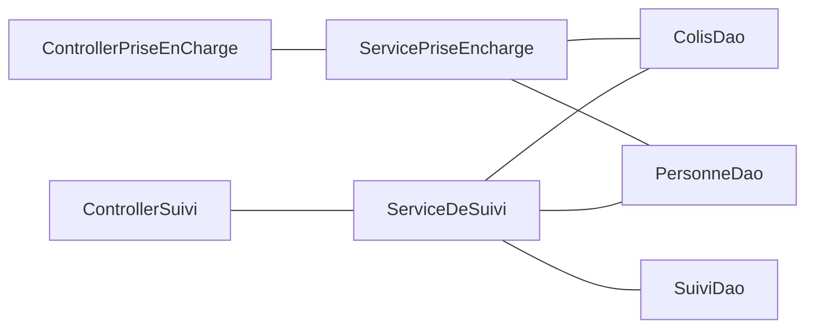
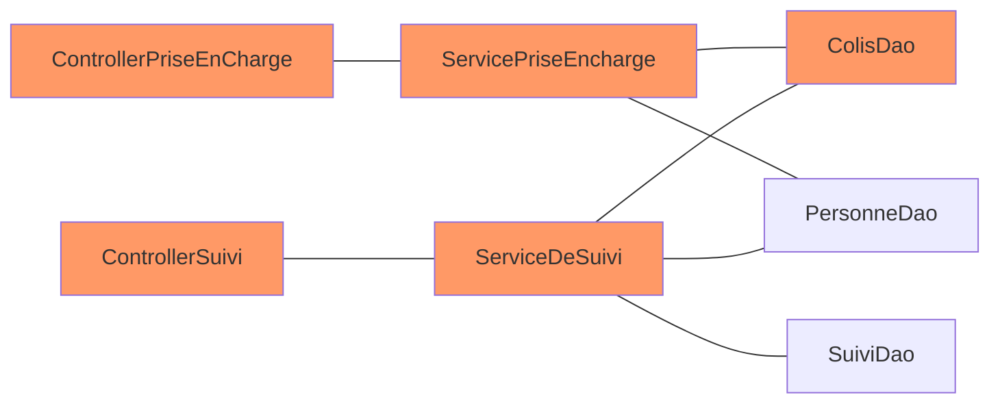

import ReactPlayer from 'react-player';
import select from './selection-verticale-2.mov';

L'architecture hexagonale est probablement mon défaut que je setup un projet.
Quand on suit certaines précos, cette architecture peut sembler intimidante et compliquée, au point que se dit tanpis, je vais commencer simplement / autrement, et on verra après.

Moi, je pense qu'au contraire, on peut commencer en archi hexa de façon simple et monter en puissance ensuite.
Et même si on fait quelques entorses, ça sera toujours mieux que de ne pas le faire.

{/* truncate */}


## L'instant musical

<iframe width="560" height="315" src="https://www.youtube.com/embed/52JhiwsjVkg?si=fFMGLEWu-ti7Olam" title="YouTube video player" frameborder="0" allow="accelerometer; autoplay; clipboard-write; encrypted-media; gyroscope; picture-in-picture; web-share" referrerpolicy="strict-origin-when-cross-origin" allowfullscreen></iframe>

## Le cas métier

Pour illustrer le sujet, on va partir d'une boite de livraison, hubert claude, qui livre des colis et qui tourne dans le cloud.

On a en gros 2 modules

## L'archi n-tiers et ses problèmes

L'archi n-tiers est probablement l'archi logicielle la plus répendue. On la retrouve souvent avec 3 niveaux :
* présentation
* logique métier
* accès aux données


Sur le papier, ça a l'air vraiment pas mal.
Comme les applications ne sont jamais aussi simple, quand on fait grossir, on peut facilement réutiliser nos composants d'accès aux données.

On suit le DRY (don't repeat yourself) et ça, c'est cool !

Avec notre use case, on aura :



Malheureusement, on vient de créer un monolithe spaghetti assez difficile maintenir et l'architecture n-tiers ne nous protège pas du tout de ça.

Dans l'architecture ci-dessus, si on touche un aspect lié au colis, on impacte toute l'application ! Ça, c'est un vrai problème pour faire évoluer notre application, on part avec une dette technique énorme.



### La magie des frameworks, le cauchemar du métier

Un autre aspect qui pose problème, ce sont les frameworks et la façon idiomatique de s'en servir.
Si on prend l'exemple de spring, le framework en lui-même n'est pas spécialement problématique, il est ultra modulaire, bâtis sur des bases solides, facilement extensible, etc.

Le problème serait plutôt springboot qui vient avec un certain nombre de configurations par défaut, et quand on sort des défauts,
on a un peu l'impression de trahir le framework, voire même, de faire quelque chose à la marge qui pourrait rendre l'application plus difficile à maintenir pour les futurs membres de l'équipe.

Au bout d'un moment, le code technique est tellement entremêlé avec le code métier, qu'on en vient à faire des concessions sur les évolutions métier, soit parce que ça devient difficile à réaliser dans l'état, soit parce qu'on ne veut pas trahir la philosophie de l'outil.

Quand on prend ce bout de code qui est très certainement caricatural, mais pour autant assez révélateur :

```java
@Entity
@Data
public class Colis {

   @Id
   @JsonProperty("idColis")
   @JacksonXmlProperty(localName = "idColis")
   @Schema(example = "10", description = "L'identifiant du colis")
   @NotBlank
   private String id;

   @Column(name = "LAST_NAME")
   @JsonProperty("nomDeFamille")
   @JacksonXmlProperty(localName = "nomDeFamille")
   @Schema(example = "Simpsom", description = "Le nom de famille de la personne")
   @NotBlank
   private String nom;

   @Column(name = "FIRST_NAME")
   @JsonProperty("prenom")
   @JacksonXmlProperty(localName = "prenom")
   @Schema(example = "Home", description = "Le prenom de la personne")
   @NotBlank
   private String prenom;

   @ManyToOne
   @NotNull
   @Valid
   private Adresse adresse;

}
```

On fait porter à notre objet métier :
* des aspects de stockage en base de données
* des aspects de sérialisation
* des aspects de documentation d'api REST
* un peu de métier sur de la validation de format

Avec ce niveau de couplage, autant tout mettre dans le controller et ne pas se faire chier avec un découpage présentation / métier / persistance qui n'a de toute façon plus aucun sens.

Dans spring (mais c'est le cas aussi dans d'autres outils, genre Quarkus), tout est fait pour avoir ce genre de pratique :
* Des annotations à gogo qui ne fonctionnent qu'avec le framework d'injection de dépendance
* Ma sérialisation d'exception pour faire des réponses http d'api
* Des handlers d'exception globaux : on ne sait plus qui retourne telle erreur ou tel status http
* ...

Bref, le métier est disséminé dans la technique et inversement, c'est le gros merdier ! Heureusement que l'archi hexa aide à remettre un peu d'ordre dans tout ça !

Bien évidement, certaines problématiques énoncées ci-dessus, pourront subsister, mais les rôles de chaque composant seront bien définis.


## L'archi hexa c'est quoi ?

Dans l'archi hexa, on va garder un peu la même structure, on aura :


Jusque-là, pas de quoi se taper le cul dans un seau, c'est le même schéma que tout à l'heure.

On se croirait dans le nouveau projet agile, où, on a renommé "chef de projet" en "agile master" mais rien d'autre n'a changé.

Et pourtant si ! Quelque chose a changé ! Ici, c'est le domaine qui impose son style !

Le domaine communique avec la couche d'accès aux données par le côté droit et avec la couche de présentation par le côté gauche.

À droite, là où dans le modèle n-tiers, c'est le `DAO` (data access object) qui retournait un objet venant de la base de données, avec lequel le service métier devait se débrouiller,
dans l'archi hexagonale, c'est domaine métier qui va imposer le format à la couche d'accès aux données, qui va devoir se charger de faire la conversion vers, par exemple la base de données.

À gauche, le domaine va exposer des services métiers, et la couche de présentation va se charger d'adapter ces services en http, graphql, grpc ou autres.

On nomme port, les portes qui existent du domain vers l'extérieur et adapters les implémentations concrètes qui existent. Les ports sont dans la couche domaine / métier alors que les adapters ou adaptateurs sont dans la couche infrastructure.
Les ports et adapters de la partie présentation sont dit primaire (primary), tandis que les ports et adapters de la partie accès aux données sont dit secondaire (secondary).

Concrètement, le domaine ne doit pas connaître ce qui se passe gauche ni à droite. Si on traduit ça en code, il ne doit y avoir aucun import de classe provenant des couches présentation ou persistance dans le domaine !

Le domaine :
* ne doit pas savoir que c'est stocké dans postgresql, oracle, mongo...
* ne doit pas savoir que c'est publié dans kafka, rabbitmq...
* ne doit pas savoir que c'est éxposé en http, graphql
* ne doit pas savoir qu'on utilise spring, quarkus, ...
* ne doit pas savoir que c'est sérialisé en json
* ne doit pas savoir qu'il y a un doc d'API swagger
* ...

Le métier peut donc se faire une place parmi les frameworks et ça, c'est positif.

Un des aspects très positif de cette architecture logicielle, c'est qu'on peut très vite coder la partie métier et la tester en s'appuyant sur des stubs.

J'ai loupé par deux fois un lab de Guillaume Saint-Etienne & Anthony Cassaigne sur les stratégies de gestion de stubs pour les tests dans les archis hexa dont un collègue m'a dit beaucoup de bien. S'ils passent par chez vous, faites-vous plaisir !


### Pourquoi c'est si compliqué ?

Jusque-là, c'est plutôt simple, mais alors pourquoi j'entends souvent :
* c'est un projet simple, partir sur de l'archi hexa c'est overkill
* je ne peux pas faire d'achi hexa, je fais du webflux et on ne peut pas utiliser de framework dans le domaine
* je ne comprends rien à l'organisation des projets, je ne sais jamais si mon controller c'est primary ou secondary
* j'en ai marre de coder des mappers
* ...


#### Séparer l'infra et le métier ne veut pas dire vanilla

Faire de l'archi hexa ne veut pas forcément dire faire du java vanilla, sans dépendances externes.
Il y a une idée qui circule sur le fait qu'on pourrait extraire la partie domaine et la faire tourner avec n'importe quel autre framework.

Franchement, on s'en fout ! Déjà si, les aspects de persistance et de présentation ne viennent pas leaker dans le métier, c'est énorme et l'application sera bien plus maintenable qu'une bonne partie des applis n-tiers.

Vous voulez utiliser, lombok, les bean validation, vavr, commons lang ou je ne sais quoi, allez y !

#### Clean archi et archi hexa

La clean archi est une sorte de version avancée de l'archi hexagonale, formalisé par Robert C. Martin.
La vision de Robert C. Martin est plus structurée et plus rigide que la simple hexagonale mais, on n'est pas obligé d'aller jusque-là.

J'aurai même tendance à penser que le jargon qui est introduit : use cases, entities, adapters etc, vient prendre de la place sur le jargon métier qui devrait être prédominant dans notre application.

Si vous aimez la rigueur et les choses cadrées pourquoi pas, mais ça n'est pas une obligation.

#### La terreur des mappers

Un des côtés négatif de l'architecture hexagonale, c'est de devoir sans cesse, faire du mapping de données du domaine vers la couche d'accès aux données et du domaine vers la couche de présentation.

Eh bien, c'est vrai, mais il existe des stratégies pour mitiger ce problème, je vais essayer de vous donner quelques pistes.

## Le package minimum

Je vous donne de mon point de vue sur les règles auxquelles il ne faut pas déroger :
* Aucun import provenant des adaptateurs
* Aucun code teinté par des problématiques d'infrastructure : transaction, pagination, cache etc
* Aucun aspect lié à de la sérialisation
* Aucun aspect lié à de la documentation d'API
* Aucun code lié au framework d'injection (et encore s'il y a des annotations `@Component`, ça ne met pas le métier en péril)

Maintenant, on va parcourir plusieurs items et proposer des solutions.

### Structurer le projet

Le but va être de bien séparer l'infrastructure du code métier. Ceci peut être fait via des packages ou des modules.

Il existe une catégorisation des ports et des adaptateurs :
* primary : pour la partie présentation
* secondary : pour la partie accès aux données

Je trouve que faire figurer ce découpage dans l'orga du projet embrouille. J'aurai plutôt tendance à avoir un package `infrastructure` avec des sous packages `data` et `api` ou `presentation`, mais rien de plus et un package `domain`.

Dans `domain`, c'est comme vous voulez ! Mais je ne ferai pas figurer de package `port`, les noms des interfaces doivent être parlant et traduire le métier sous-jacent.

Il est possible de structurer le projet en modules, ceci permet d'éviter les imports malheureux de l'infra vers le métier qui pourraient exister.

### Passer un context de la présentation vers l'accès aux données

Si vous avez besoin de passer un context technique, par exemple une transaction, et vous ne voulez pas que votre domaine connaisse ce context, vous pouvez utiliser des generics.

Exemple :

```java
public class PriseEnChargeDeColis<Ctx> { // On a un generic qui définit notre context

   private final LesColis<Ctx> lesColis; // Nos ports / SPI sont générifiés
   private final PositionsGps<Ctx> positionsGps;

   public PriseEnChargeDeColis(LesColis<Ctx> lesColis, PositionsGps<Ctx> positionsGps) {
       this.lesColis = lesColis;
       this.positionsGps = positionsGps;
   }

   public Colis prendreEnChargeLeColis(Ctx ctx, Colis colis) throws AdresseInvalideException, ColisInvalidException {
       validerFormat(colis);
       // On passe le context lors des appels à nos ports, l'adapter lui aura une implémentation concrète, par exemple une `Connection`
       Position position = this.positionsGps.trouverPositionGps(ctx, colis.adresse());
       if (position == null) {
           throw new AdresseInvalideException(colis.adresse());
       }

       Colis colisAvecGps = colis.updatePosition(position);
       return this.lesColis.sauvegarder(ctx, colisAvecGps);
   }
}

```

### Faire quand même des mappers

Il y a de fortes chances que vous ayez à faire des mapper pour passer de la couche domaine / métier à la couche infrastructure.
Il est potentiellement possible de s'en passer dans un premier temps (CF les chapitres suivants), mais si vous en écrivez, voici 2 solutions pour atténuer la pénibilité :

#### Utiliser un assistant de code IA

Quitte à utiliser une IA pour nous assister dans notre développement, autant lui faire faire les tâches relou et se garder les choses intéressantes.
Personnellement, je ne trouve pas que coder des mapper soit particulièrement gratifiant. S'il y a bien une tâche que je pourrais confier à une IA, c'est celle-ci.

#### Selection verticale

Avec la selection verticale et du CTRL-C / CTRL-V, on peut faire pas mal de choses très rapidement avec un peu de pratique et de dextérité. Les mappers rentrent clairement dans les taches réalisables comme ça.

Voici un exemple d'utilisation de selection verticale pour faire des setters et un mapper.
Les raccourcis utilisés (sur mac) sont :
* cmd C / cmd V pour copier / coller
* cmd shift U pour passer en majuscule / minuscule
* cmd flèche et cmd shift flèche pour déplacer le curseur ou sélectionner des morceaux de ligne

<ReactPlayer playing="true" controls url={select} volume={0} width={800}/>

#### Les libs de mapper

Il existe des libs pour faire du mapping de données. Je n'ai d'expérience sur aucune des libs et donc aucun avis sur la question.

### Injection de dépendances

Les annotations des frameworks d'injections de dépendance n'ont à priori rien à faire dans la couche domaine.

Perso, je me dis que s'il devait trainer des `@Component` dans le domaine, c'est un moindre mal, ça ne met pas en péril les règles métier et le domaine reste portable.
Si c'est cet aspect qui vous pousse à ne pas faire d'archi hexa eh bien, allez y, ne vous prenez pas la tête ! (c'est peut-être mon côté à l'arrache qui parle ici)

Le mieux reste cependant de s'en passer, il existe plusieurs stratégies si vous faites du spring :
* Des classes de configuration mais, vous devrez écrire les `new` vous-même
* Des annotations custom à faire scanner par spring, [CF la conf de Julien Topçu](https://www.youtube.com/watch?v=-dXN8wkN0yk)
* Étendre les classes du domaine et ajouter les annotations sur ces classes-là

Choisissez la solution qui vous plait le plus !

### Documentation swagger

Si on ne souhaite pas faire de mapper tout de suite pour une exposition en API http, et qu'on veut pouvoir documenter, mettre des annotations swagger sur notre objet du domaine ne sera possible.

Je vous propose 2 approches : utiliser la javadoc ou utiliser des wrappers

#### Javadoc

La lib [therapi-runtime-javadoc ](https://github.com/dnault/therapi-runtime-javadoc) propose de générer de la documentation swagger à partir de la javadoc, plutôt cool non ?

#### Les wrapper

On peut utiliser un wrapper qui servira de resource d'API sur lequel on mettra les annotations swagger :

```java
@Schema(description = "Le Colis pris en charge")
public record ColisResource(Colis colis) {

   @Schema(description = "L'adresse de livraison du Colis")
   public Adresse adresse() {
       return colis.adresse();
   }
}
```

Avec intellij, on peut lui demander de générer les "delegates method" ce qui rend l'implémentation très facile. Ceci est très adapté pour les APIs de lecture par trop pour l'écriture, il faudra passer par un DTO et un mapper.

### Sérialisation json

#### Wrapper

Comme pour la doc, vous pouvez utiliser un mapper pour exposer votre objet du domaine en ressource REST. Même contrainte : ça n'est pas adapté pour l'écriture.

```java
@Schema(description = "Le Colis pris en charge")
public record ColisResource(Colis colis) {

   @JsonProperty("uneAdresse")
   @Schema(description = "L'adresse de livraison du Colis")
   public Adresse adresse() {
       return colis.adresse();
   }
}
```

#### Parsing avancé

Une autre solution que j'affectionne, car c'est ce que j'utilise, c'est parser le json à "la main". Pour ça, j'ai écrit cette lib : https://github.com/MAIF/functional-json/.

Ici l'idée est de proposer des `Reader` et des `Writer` pour à respectivement lire et écrire du json. C'est en quelque sorte un mapper vers un `JsonNode` de jsckson.

Par rapport à un DTO + mapper, les avantages sont les suivants :
* plus simple de maintenir les évolutions de schéma, car il est facile de faire du fallback ou d'écrire plusieurs reader pour un même type de données.
* la lib collecte les erreurs donc s'il y a plusieurs problèmes, on a tout d'un coup
* fonctionne bien avec l'approche ["parse, don't validate"](https://larousso.github.io/blog/parse-dont-validate/) et notamment pour la collecte des erreurs.


### Couche d'accès aux données

En général, on écrit des mappers vers la couche d'accès aux données, car on fait du JPA. On va alors mapper l'objet du domaine vers l'entité JPA et c'est un peu lourd.

Je vous propose de ne pas faire de JPA mais directement du SQL. Vous aurez un mapper, mais vers du SQL. C'est l'occasion de reprendre la main sur la partie persistance et de maitriser un peu ce qu'on fait.

Je ferai probablement un article dédié, mais voici des approches avec postgresql.

#### Stockage en json

Ici, c'est du plain JDBC sans autre framework, mais on peut aussi utiliser du jooq.

Dans cet exemple, on stocke tout dans une colonne JSONB de postgresql, `insert on conflict do update` permet de faire un upsert (maintenant, il existe `merge` mais je n'ai pas testé) :

```java
@Override
public Colis sauvegarder(Connection connection, Colis colis) {
   var sql = """
          insert into colis (id, json)
              values(?, ?::JSONB)
              on conflict (id)
          do update
          set
              json = EXCLUDED.json::JSONB
          returning json
          """;
   try(var stm = connection.prepareStatement(sql)) {
       stm.setString(1, colis.id());
       stm.setString(2, mapper.writeValueAsString(colis));
       ResultSet resultSet = stm.executeQuery();
       return mapper.readValue(resultSet.getString(0), Colis.class);
   } catch (SQLException e) {
       throw new RuntimeException(e);
   } catch (JsonProcessingException e) {
       throw new RuntimeException(e);
   }
}

```

#### Stockage classique

Même chose en stockage classique :

```java
@Override
public Colis sauvegarder(Connection connection, Colis colis) {
   var sql = """
          insert into colis (id, reference, weight, fragile)
              values(?, ?, ?, ?)
              on conflict (id)
          do update
          set
              reference = EXCLUDED.reference,
              weight = EXCLUDED.weight,
              fragile = EXCLUDED.fragile
          returning *
          """;
   try(var stm = connection.prepareStatement(sql)) {
       stm.setString(1, colis.id());
       stm.setString(2, colis.reference());
       stm.setString(3, colis.weight());
       stm.setString(4, colis.fragile());
       ResultSet resultSet = stm.executeQuery();
       return mapper.readValue(resultSet.getString(0), Colis.class);
   } catch (SQLException e) {
       throw new RuntimeException(e);
   } catch (JsonProcessingException e) {
       throw new RuntimeException(e);
   }
}

```

Si vous ne voulez pas mapper colonne par colonne, il existe cette possibilité à partir d'un json :

```java
@Override
public Colis sauvegarder(Connection connection, Colis colis) {
   var sql = """
          insert into colis (id, reference, weight, fragile)
              select * from json_populate_record(null::viking, ? );
              on conflict (id)
          do update
          set
              reference = EXCLUDED.reference,
              weight = EXCLUDED.weight,
              fragile = EXCLUDED.fragile
          returning *
          """;
   try(var stm = connection.prepareStatement(sql)) {
       stm.setString(1, colis.id());
       stm.setString(2, mapper.writeValueAsString(colis));
       ResultSet resultSet = stm.executeQuery();
       return mapper.readValue(resultSet.getString(0), Colis.class);
   } catch (SQLException e) {
       throw new RuntimeException(e);
   } catch (JsonProcessingException e) {
       throw new RuntimeException(e);
   }
}
```

On peut faire des upsert de masse avec cette technique, très pratique !

## On n'a pas réglé tous les problèmes !


